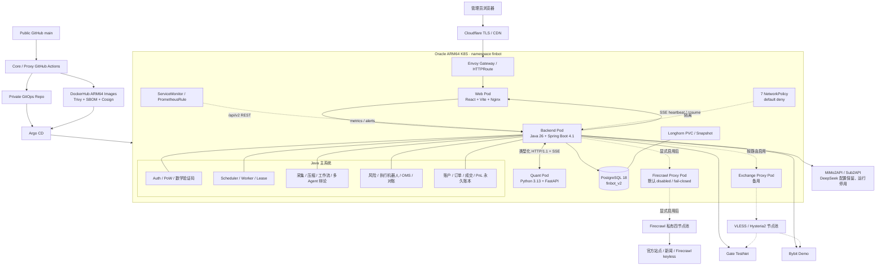

# FinBot

[](https://github.com/Prodigalgal/FinBot/actions/workflows/ci-deploy.yml)
[](https://github.com/Prodigalgal/FinBot/actions/workflows/proxy-deploy.yml)

FinBot 是面向自动研究与模拟交易的 AI 决策平台。系统按定时或即时请求收集信息，清理与压缩证据，合并交易所行情和 Python 量化结果，执行可配置的多 Agent 多轮辩论，再由独立风控与反思型执行机器人处理 Gate TestNet / Bybit Demo 模拟交易。

当前生产主系统为 Java 26 + PostgreSQL + `/api/v2`。旧 Python Web/Worker 已从主仓库移除，并独立归档到 `D:\WorkSpace\Project\archive-project\FinBot`；主仓库不再包含 SQLite 运行入口或旧 API 兼容层。

## 系统边界

- Java 是业务状态、调度、工作流、交易决策、OMS 和永久账本的唯一权威所有者。
- Python Quant 只负责无状态量化计算，通过类型化 HTTP/SSE 契约与 Java 通信。
- React 管理台只访问 Java `/api/v2`，SSE 支持断线续传与 heartbeat。
- PostgreSQL `finbot_v2` 保存运行状态和 append-only 交易事实；SQLite 不参与生产。
- Gate TestNet 与 Bybit Demo 仅对已验证且开启 `execution_enabled` 的合约允许策略约束内的自动模拟执行；Mainnet/Live 私有写入在多层代码门禁中永久阻断。
- 产品使用 `canonical_product -> venue_instrument -> exchange_account` 三层模型；关闭交易所账户会同时阻止其行情候选、账户同步、风控候选和新订单，但保留产品与历史账本。
- 每个 LLM 工作流节点和最终交易机器人阶段可独立配置主模型、兜底模型、思考强度、超时和重试；执行顺序固定为主模型重试耗尽后再进入兜底模型。
- 生产采用单副本应用服务，不承诺高可用；允许发布期间短暂中断。



生产 Kustomize 当前渲染 30 个声明对象，但常驻计算只有 6 个 Pod：

| 类型 | 数量 | 是否常驻计算 | 说明 |
| --- | ---: | --- | --- |
| Deployment | 6 | 5 个 Pod | Backend、Web、Quant、两个 Proxy 各 1；legacy freeze 固定 0 副本 |
| StatefulSet | 1 | 1 个 Pod | PostgreSQL 单实例 |
| Job | 3 | 否 | DB bootstrap、Liquibase、历史导入，仅 Argo Hook 期间存在 |
| Service / HTTPRoute | 6 / 2 | 否 | 集群寻址、HTTPS 路由与 HTTP 重定向 |
| NetworkPolicy | 7 | 否 | 默认拒绝及按组件放行 |
| Namespace / ConfigMap / PVC | 1 / 1 / 1 | 否 | 隔离、非敏感配置和持久卷声明 |
| ServiceMonitor / PrometheusRule | 1 / 1 | 否 | 指标抓取与告警规则 |

## 仓库结构

```text
FinBot/
├─ apps/
│  └─ web/                    React + TypeScript 管理台
├─ services/
│  ├─ backend/                Java 多模块主系统与一次性迁移工具
│  ├─ quant/                  Python 无状态量化服务
│  └─ proxy-gateway/          Python + sing-box 代理控制面
├─ platform/
│  └─ k8s/                    Kustomize、迁移 Hook、NetworkPolicy 与运行手册
├─ contracts/                 跨服务 OpenAPI 契约
├─ docs/                      需求、ADR、迁移、验收报告和历史设计
├─ scripts/                   仓库级安全与维护脚本
├─ tasks/                     当前、进行中和已完成任务
├─ config/                    本地敏感运行配置，默认不入 Git
└─ data/                      本地运行数据，默认不入 Git
```

各目录职责和文档入口见 [`docs/README.md`](./docs/README.md)，目录边界决策见 [`docs/decisions/013-monorepo-layout.md`](./docs/decisions/013-monorepo-layout.md)。

## 组件

| 组件 | 技术 | 责任 |
| --- | --- | --- |
| `services/backend/finbot-bootstrap` | Java 26、Spring Boot 4.1 | Auth、REST/SSE、常驻 Worker、Scheduler 和依赖装配 |
| `services/backend/finbot-domain` | 纯 Java | 值对象、聚合状态、状态机与领域约束 |
| `services/backend/finbot-application` | Java | 用例、端口、异步任务和跨聚合编排 |
| `services/backend/finbot-infrastructure` | Spring Data JDBC、`JdbcClient`、Liquibase | PostgreSQL、AI、交易所、Firecrawl 和 Quant adapter |
| `services/backend/finbot-migration` | Java 26 | 只读历史导入；不进入在线运行时 |
| `services/quant` | Python 3.13、FastAPI | 回测、指标、组合优化与 HTTP/SSE 量化输出 |
| `services/proxy-gateway` | Python 3.13、sing-box | VLESS/Hysteria2 订阅、健康选择和 HTTP proxy bridge |
| `apps/web` | React、TypeScript、Vite、MUI | 单管理员运营台、产品库、研究、DAG、交易与运维视图 |

## 环境要求

- JDK 26
- Python 3.13
- Node.js 22
- PostgreSQL 18
- Docker/BuildKit（镜像或 Testcontainers 验证时需要）
- Kustomize 与 kubectl（部署验证时需要）

所有 Secret 通过环境变量、GitHub Actions Secret 或 K8S Secret 注入。字段清单见 [`.env.example`](./.env.example) 和 [`platform/k8s/finbot-secrets.env.example`](./platform/k8s/finbot-secrets.env.example)，真实 key、密码、代理订阅和节点 URL 禁止进入仓库、日志或构建产物。

## 本地验证

```powershell
$env:JAVA_HOME = 'D:\DevlopEnv\JDK\jdk-26.0.1'
Set-Location services/backend
.\gradlew.bat --no-daemon clean test :finbot-bootstrap:bootJar :finbot-migration:bootJar

Set-Location ..\quant
python -m pip install -e ".[dev]"
python -m ruff check src tests
python -m mypy src tests
python -m pytest -q
python -m openapi_spec_validator ..\..\contracts\quant-research.openapi.yaml

Set-Location ..\proxy-gateway
python -m pip install -e ".[dev]"
python -m ruff check src tests
python -m mypy src tests
python -m pytest -q

Set-Location ..\..\apps\web
npm ci
npx tsc -b --clean
npm run build
```

Testcontainers 需要可用 Docker daemon；没有 Docker 时本地 PostgreSQL 集成测试会显式标记 skipped，GitHub Actions 会在 Linux runner 中强制执行。

## 本地运行

先准备 PostgreSQL 18 和 `.env.example` 中的必填环境变量，再分别启动以下进程：

```powershell
# Terminal 1: Quant
Set-Location services/quant
python -m finbot_quant.main

# Terminal 2: Java API + Worker + Scheduler
Set-Location services/backend
$env:JAVA_HOME = 'D:\DevlopEnv\JDK\jdk-26.0.1'
.\gradlew.bat :finbot-bootstrap:bootRun

# Terminal 3: Web
Set-Location apps/web
npm run dev
```

默认端口为 Java `8080`、Quant `8081`、Vite `5173`。管理员登录要求用户名/密码、一次性数学验证码和 SHA-256 PoW；账号密码只从环境变量注入。

## 生产发布

`main` 分支使用两条独立流水线：

- Core CI：Java、Quant、React、PostgreSQL、浏览器 smoke、Secret scan、Kustomize、Trivy、SBOM 与 Cosign。
- Proxy CI：Proxy 类型检查、测试、ARM64 镜像、Trivy、SBOM 与 Cosign。

镜像推送到 `docker.io/speedproxy`，随后流水线只修改私有 GitOps 仓库 `Prodigalgal/ircs-prod-config/finbot`。Argo CD Application `finbot` 在 Oracle ARM64 K8S 中以单副本同步；CI 不持有 kubeconfig，也不直接写生产集群。

生产 Secret、迁移、验证、回滚和清理命令见 [`platform/k8s/README.md`](./platform/k8s/README.md)。

## 数据与交易安全

- 账户、余额、持仓、订单、成交和 PnL 同时保留交易所来源事实与本地审计事实。
- 定时任务使用 PostgreSQL lease 与幂等键，异常退出后可恢复，不依赖进程内队列。
- 交易建议、风险批准和可执行订单为不同强类型状态；`PROPOSED` 不等于已下单。
- 执行机器人只能批准输入中的既有决策，不能自行改变方向、数量、杠杆或交易环境。
- 任何 AI、风险、预算、映射或交易所提交阶段失败都 fail-closed。

## 文档

- 架构：[`docs/requirements/29-java-python-breaking-architecture.md`](./docs/requirements/29-java-python-breaking-architecture.md)
- ADR：[`docs/decisions/012-java26-spring-data-jdbc-liquibase-python-quant.md`](./docs/decisions/012-java26-spring-data-jdbc-liquibase-python-quant.md)
- 模型兜底与杠杆语义：[`docs/decisions/014-configurable-fallback-and-leverage-semantics.md`](./docs/decisions/014-configurable-fallback-and-leverage-semantics.md)
- 交易所/产品控制面：[`docs/decisions/015-exchange-product-control-plane.md`](./docs/decisions/015-exchange-product-control-plane.md)
- Binance Demo TradFi 调查：[`docs/reports/07-binance-demo-tradifi-assessment.md`](./docs/reports/07-binance-demo-tradifi-assessment.md)
- 迁移门禁：[`docs/migrations/010-java-breaking-exec-plan.md`](./docs/migrations/010-java-breaking-exec-plan.md)
- 生产验收：[`docs/reports/30-java-breaking-migration-acceptance.md`](./docs/reports/30-java-breaking-migration-acceptance.md)
- 项目规则：[`AGENTS.md`](./AGENTS.md)

历史 Python 阶段设计仅用于追溯，统一位于 [`docs/archive/legacy-python`](./docs/archive/legacy-python)。独立旧代码归档没有生产远端，也不参与主仓库 CI/CD。
