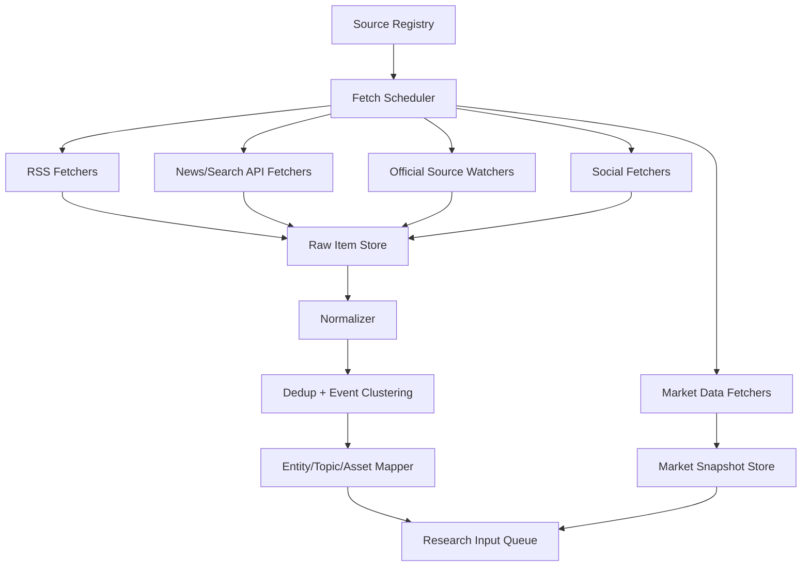

# FinBot 信息源获取层设计

## 目标边界

FinBot 当前定位是研究机器人，不做自动交易，不做机器学习训练。信息源获取层的目标是：

- 尽快发现会影响资产价格的事件。
- 把新闻、官方数据、社交讨论和行情异动统一成可审计的证据。
- 给后续 AI 研究层提供结构化输入，而不是直接给买卖指令。
- 对原油、黄金、纳指、美元、加密货币等高相关品种建立事件映射。

不做：

- 不接交易权限 API。
- 不自动下单。
- 不把单一新闻情绪分数当作交易信号。
- 不训练模型，最多调用 LLM 或现成情绪模型做推理和归类。

## 参考项目观察

### Binance-News-Sentiment-Bot

位置：`参考/Binance-News-Sentiment-Bot`

它的做法：

- 用 `Crypto feeds.csv` 维护 RSS 源列表。
- 用 `aiohttp + asyncio` 并发抓 RSS。
- 只保留最近 `HOURS_PAST` 小时内的新闻。
- 用关键词把标题归类到币种。
- 用 NLTK VADER 对标题做情绪分数。
- 用平均情绪和文章数量阈值触发动作。

可借鉴：

- RSS 源配置化。
- 异步抓取。
- 时间窗口过滤。
- 先分类再汇总情绪。

不能照搬：

- 它直接把情绪阈值接到交易动作。
- 只靠标题和关键词，容易误判。
- 只取 RSS 中很少字段，缺少原文 URL、来源权重、去重、事件聚类。

### cryptocurrency-news-analysis

位置：`参考/cryptocurrency-news-analysis`

它的做法：

- 对每个关键词调用 Web Search News API。
- 获取标题和描述。
- 调用外部情绪 API。
- 汇总正面、中性、负面比例。

可借鉴：

- 按关键词主动搜索，比单纯 RSS 更适合发现某个主题的新消息。
- 标题 + 描述比单标题更稳。

不能照搬：

- RapidAPI 依赖重，供应商可替换性弱。
- 没有去重和来源可信度。
- 没有处理“同一事件多篇报道”的聚类问题。

### TradingAgents

位置：`参考/TradingAgents`

它的做法：

- 把数据源抽象成工具：ticker news、global news、macro indicators、prediction markets。
- 在配置里维护 `global_news_queries`，例如利率、GDP、制裁、能源供应链。
- 支持不同数据供应商路由：`yfinance`、`alpha_vantage`、`fred`、`polymarket`。
- News Analyst 用工具获取新闻和宏观数据，再生成报告。
- Sentiment Analyst 同时预取新闻和 StockTwits，要求模型区分事件和观点。

可借鉴：

- 数据供应商路由层。
- 全局宏观新闻查询列表。
- 工具式数据获取接口。
- 把新闻、宏观、预测市场和社交情绪分开输入给 AI。
- 明确要求区分 event 和 opinion。

需要改造：

- 它偏股票研究，ticker 新闻逻辑不完全适合 `XTIUSD/USOIL/NAS100/XAUUSD` 这种 CFD/指数/商品。
- 它的输出仍然偏 BUY/HOLD/SELL，我们要改成研究结论和机会提醒。

### OpenBB

位置：`参考/OpenBB`

它的价值主要是数据供应商聚合。项目里能看到多类新闻 provider：

- Benzinga company/world news
- Biztoc world news
- Yahoo Finance company news
- FMP company/world news
- Tiingo company/world news
- Intrinio company/world news

可借鉴：

- provider 标准化。
- company news 和 world news 分层。
- 字段标准化：标题、摘要、来源、发布时间、标签、相关 symbol。

短期不建议直接重度集成整个 OpenBB 平台，因为依赖较多。更适合先参考它的 provider 抽象和字段设计。

### FinGPT

位置：`参考/FinGPT`

它的重点不是抓取，而是金融文本情绪推理。项目文档中有一个思路：

- Serper AI 做实时新闻检索。
- FinGPT-Sentiment 做金融情绪评分。
- Alpha Vantage 做历史数据。

可借鉴：

- 搜索 API + 金融情绪模型的组合。
- 情绪模型只作为证据之一，不直接输出交易动作。

## 我们的信息源分层

FinBot 的信息源不应该是一条线，而是四层互补。

### L0 行情确认源

用途：判断消息是否已经反映到价格，避免“新闻对，但已经涨完了”。

首批接入：

- Bybit 公共行情：tickers、kline、orderbook、funding。
- Gate 公共行情：tickers、kline、contract info。
- 必要时用 CCXT 统一部分加密现货/合约行情。

注意：

- 只需要 public market data，不需要交易权限。
- Gate 的 CFD 品种如 `XTIUSD` 是否完整开放 API 需要单独验证；如果官方 API 不覆盖 CFD，则只能先把 Gate CFD 作为人工观察或网页端数据源，不能强依赖。

### L1 官方和一级信息源

用途：低噪声、高可信。对宏观和大宗商品尤其重要。

建议首批：

- 美国 EIA：原油库存、汽油库存、周报、短期能源展望。
- FOMC / Federal Reserve：利率决议、会议纪要、官员讲话。
- BLS / BEA：CPI、PPI、非农、GDP、PCE。
- U.S. Treasury：制裁公告。
- White House / Department of Defense / State Department：战争、制裁、外交事件。
- OPEC：月报、会议公告。

设计原则：

- 优先官方 RSS/API/日历。
- 对固定时间发布的数据，提前维护经济日历。
- 对突发公告，采用 RSS 或页面变更监控。

### L2 新闻聚合源

用途：更快发现市场已经在传播的事件。

建议首批：

- RSS 源池：Reuters/CNBC/MarketWatch/OilPrice/Investing/Yahoo Finance/CoinDesk/CoinTelegraph 等可合法读取的公开源。
- Yahoo Finance / yfinance news：低门槛补充。
- Google News via Serper：主题搜索补漏，例如 `"Iran oil tanker missile"`、`"Trump sanctions oil"`。
- Alpha Vantage NEWS_SENTIMENT：可选，带新闻情绪和 topic。
- OpenBB provider 思路：后续可接 Benzinga/FMP/Tiingo/Biztoc 等。
- GDELT：可选，适合全球新闻事件检索和多语种覆盖。

设计原则：

- RSS 适合广覆盖低成本轮询。
- 搜索 API 适合按事件关键词主动补漏。
- 付费金融新闻 API 适合提高质量和延迟表现。

### L3 社交和市场情绪源

用途：观察散户情绪、叙事热度、谣言扩散，不作为事实本身。

建议首批：

- StockTwits：适合股票、指数 ETF、部分加密相关符号。
- X/Twitter：如果有可用 API，再接入；否则不作为第一版强依赖。
- Polymarket：用作事件概率参考，比如战争、降息、选举、衰退等市场隐含概率。

设计原则：

- 明确标记为 opinion，不和 official/news 混为一谈。
- 社交数据要看样本量、互动量、账号可信度。
- 谣言只能触发“观察提醒”，不能触发强结论。

## 信息源注册表

所有信息源用配置文件管理，建议 `config/sources.yml`：

```yaml
sources:
  - id: yahoo_finance_news
    type: news_api
    tier: L2
    provider: yfinance
    enabled: true
    poll_interval_sec: 300
    trust_weight: 0.65
    latency_class: medium

  - id: crypto_rss_pool
    type: rss_pool
    tier: L2
    enabled: true
    poll_interval_sec: 120
    trust_weight: 0.45
    file: config/rss/crypto.yml

  - id: eia_petroleum
    type: official_calendar
    tier: L1
    enabled: true
    poll_interval_sec: 900
    trust_weight: 0.95

  - id: bybit_market
    type: market_data
    tier: L0
    enabled: true
    poll_interval_sec: 5
    trust_weight: 0.90
```

RSS 源单独拆文件：

```yaml
feeds:
  - id: oilprice
    url: https://oilprice.com/rss/main
    domains: [oilprice.com]
    topics: [oil, energy, opec]
    trust_weight: 0.55

  - id: coindesk
    url: https://www.coindesk.com/arc/outboundfeeds/rss/
    topics: [crypto, bitcoin, ethereum]
    trust_weight: 0.60
```

## 标准化数据模型

### RawSourceItem

原始采集记录，保留未加工文本，便于追溯。

```json
{
  "id": "source-local-id-or-hash",
  "source_id": "oilprice",
  "source_tier": "L2",
  "fetched_at": "2026-07-08T10:10:00Z",
  "published_at": "2026-07-08T10:07:00Z",
  "url": "https://...",
  "title": "...",
  "summary": "...",
  "raw": {}
}
```

### NormalizedItem

统一后的新闻/公告/社交记录。

```json
{
  "item_id": "sha256(source_id|url|title|published_at)",
  "kind": "news",
  "source_id": "oilprice",
  "source_tier": "L2",
  "source_trust": 0.55,
  "language": "en",
  "published_at": "2026-07-08T10:07:00Z",
  "title": "...",
  "summary": "...",
  "url": "https://...",
  "entities": ["Iran", "OPEC", "oil"],
  "topics": ["geopolitics", "energy_supply"],
  "mentioned_assets": ["XTIUSD", "USOIL", "CL", "XAUUSD"],
  "content_hash": "..."
}
```

### EventCluster

同一事件的多来源聚合。

```json
{
  "cluster_id": "evt_20260708_iran_oil_supply_001",
  "first_seen_at": "2026-07-08T10:07:00Z",
  "last_seen_at": "2026-07-08T10:18:00Z",
  "headline": "Middle East supply risk drives crude oil higher",
  "event_type": "geopolitical_supply_risk",
  "source_count": 5,
  "primary_sources": ["reuters", "oilprice", "yahoo_finance"],
  "confidence": 0.78,
  "novelty": 0.92,
  "entities": ["Iran", "United States", "crude oil"],
  "asset_impacts": [
    {
      "asset": "XTIUSD",
      "direction_hypothesis": "bullish",
      "reason": "supply risk premium",
      "confidence": 0.74
    },
    {
      "asset": "XAUUSD",
      "direction_hypothesis": "bullish",
      "reason": "safe-haven demand",
      "confidence": 0.60
    },
    {
      "asset": "NAS100",
      "direction_hypothesis": "bearish",
      "reason": "risk-off pressure",
      "confidence": 0.52
    }
  ]
}
```

### MarketContextSnapshot

行情确认输入，不是交易信号。

```json
{
  "asset": "XTIUSD",
  "venue": "gate",
  "ts": "2026-07-08T10:18:00Z",
  "last": 75.24,
  "change_5m_pct": 1.8,
  "change_1h_pct": 3.7,
  "volume_zscore": 4.2,
  "near_intraday_high": true,
  "spread_bps": 8.5
}
```

## 采集流程



## 去重和聚类

必须做去重，否则同一条新闻被 20 个站转载，会被 AI 误以为是 20 个独立事件。

第一版策略：

- URL 归一化：去掉 `utm_*`、`ref`、`fbclid` 等参数。
- 标题标准化：小写、去标点、去来源后缀。
- `content_hash = sha256(normalized_title + canonical_domain + published_date)`。
- 近似去重：标题相似度高于 0.88 且发布时间相差小于 6 小时，归为同一候选。
- 事件聚类：按实体、主题、发布时间窗口合并。

第二版再考虑 embedding 聚类，但第一版用规则足够。

## 事件到资产映射

建立 `config/asset_impact_map.yml`：

```yaml
events:
  geopolitical_supply_risk:
    keywords:
      - war
      - missile
      - sanctions
      - tanker
      - strait of hormuz
      - opec
    impacts:
      XTIUSD: {direction: bullish, reason: crude supply risk}
      CLUSDT: {direction: bullish, reason: crude supply risk}
      BZUSDT: {direction: bullish, reason: crude supply risk}
      XAUUSD: {direction: bullish, reason: safe haven}
      NAS100: {direction: bearish, reason: risk-off}

  hawkish_fed:
    keywords:
      - rate hike
      - higher for longer
      - inflation sticky
    impacts:
      DXY: {direction: bullish, reason: higher rates}
      XAUUSD: {direction: bearish, reason: real yield pressure}
      NAS100: {direction: bearish, reason: valuation pressure}
      BTCUSDT: {direction: bearish, reason: liquidity pressure}
```

注意：方向只是 hypothesis，不是结论。后续 AI 研究层要结合行情确认和上下文。

## 事件评分

每个事件聚类输出一个研究优先级分数：

```text
priority =
  source_trust_score * 0.30
  + novelty_score * 0.25
  + asset_relevance_score * 0.20
  + market_confirmation_score * 0.15
  + social_attention_score * 0.10
```

解释：

- source_trust_score：官方/Reuters/Benzinga 等更高，匿名社交更低。
- novelty_score：是否真是新消息，还是旧消息重复。
- asset_relevance_score：是否明确影响目标资产。
- market_confirmation_score：相关资产是否已出现异常波动/放量。
- social_attention_score：市场是否正在讨论。

## 第一版推荐接入顺序

### Phase 1：低成本可运行

- RSS 源池：宏观、商品、加密、财经。
- Yahoo/yfinance news：ticker/关键词补充。
- Bybit/Gate 公共行情：目标品种价格、K线、涨跌幅。
- 事件关键词映射：原油、黄金、纳指、BTC、美元。
- SQLite 存储 raw items、normalized items、event clusters、market snapshots。

这个阶段的目标是能做到：

> 出现“特朗普、战争、制裁、中东、油轮、OPEC、原油供应”等消息时，系统能在几分钟内聚合消息、关联 `XTIUSD/USOIL/CL/BZ/XAU/NAS100`，并提示“原油已经拉升多少，是否追高风险”。

### Phase 2：质量增强

- Serper/Google News Search：按事件关键词主动搜索补漏。
- Alpha Vantage NEWS_SENTIMENT：拿带 topic/sentiment 的金融新闻。
- 官方日历源：EIA、FOMC、BLS、BEA。
- StockTwits：情绪温度。
- 去重和事件聚类增强。

### Phase 3：研究报告化

- LLM 对 EventCluster + MarketContextSnapshot 生成研究卡片。
- 生成“事件链路”：来源、时间线、相关资产、行情反应、追高/追空风险。
- 通知到 Telegram/企业微信/桌面。

## 输出给 AI 研究层的格式

信息源层不要让 AI 自己随便上网乱搜，而是喂结构化 evidence package：

```json
{
  "event_cluster": {},
  "timeline": [
    {"time": "...", "source": "reuters", "title": "...", "url": "..."},
    {"time": "...", "source": "oilprice", "title": "...", "url": "..."}
  ],
  "asset_candidates": ["XTIUSD", "XAUUSD", "NAS100"],
  "market_context": {
    "XTIUSD": {},
    "XAUUSD": {},
    "NAS100": {}
  },
  "known_limits": [
    "No primary official statement found yet",
    "Only RSS/news aggregation sources confirm so far"
  ]
}
```

## 关键设计原则

1. 事实和观点分开。

   官方公告和新闻报道是事实证据；StockTwits、X 是市场情绪证据。

2. 消息和价格分开。

   消息说明“可能为什么动”；行情说明“市场是否已经动”。二者都需要。

3. 先证据包，后 AI 分析。

   AI 不直接抓全网；由系统先采集、去重、聚类、标注来源，再交给 AI。

4. 不输出买卖命令。

   输出应该是“研究结论、关注品种、可能方向、已涨跌幅、追入风险、观察点位”。

5. 每条结论必须可追溯。

   研究卡片里的每个关键判断都要能回到具体 source item 或 market snapshot。

## 下一步设计任务

1. 确定首批资产池：

   `XTIUSD/USOIL`、`XAUUSD/XAUUSDT`、`XAGUSDT`、`NAS100`、`BTCUSDT`、`ETHUSDT`、`DXY/USDJPY`。

2. 编写 `sources.yml` 和 RSS 初始列表。

3. 设计 SQLite 表：

   `raw_items`、`normalized_items`、`event_clusters`、`cluster_items`、`market_snapshots`、`asset_impacts`。

4. 做一个最小采集原型：

   RSS + Bybit/Gate tickers + 去重 + 事件关键词映射 + 控制台输出研究提醒。
