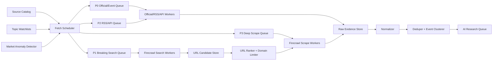

# 第一层信息源设计：广覆盖采集与 Firecrawl 增强

## 目标

第一层信息源的目标不是直接判断买卖，而是尽可能早、尽可能全地把“可能影响价格的事实、传闻、官方公告、市场异动”收集进来，并保留证据，交给后续 AI 研究层分析。

这层要解决三个问题：

1. 覆盖面足够广：宏观、地缘、商品、股票指数、加密货币、监管、交易所数据都能进来。
2. 信息不遗漏：固定源轮询 + 动态搜索 + Firecrawl 抓取补盲。
3. 信息不污染：低质量网页、重复转载、无来源传闻不能直接影响结论，必须带来源权重和证据链。

边界也要明确：

- 不做自动交易。
- 不训练机器学习模型。
- 不绕过付费墙、登录墙和网站访问限制。
- 不把“情绪分数高”直接等价于买卖建议。

## 核心思路

我们不要做一个“无限爬虫”，而是做一个“源宇宙 + 事件雷达”。

源宇宙由三部分组成：

1. 固定源目录：官方、交易所、新闻、社交、行情 API。
2. 主题监控词表：原油、黄金、纳指、加密货币、利率、战争、制裁、库存、ETF、监管等。
3. 动态发现器：用 Firecrawl Search、Serper、Google News、GDELT 等搜索能力发现新增网页，再用 Firecrawl Scrape 提取正文。

Firecrawl 的定位是“长尾网页和动态搜索增强层”，不是行情源，也不是唯一新闻源。

## 本地 Firecrawl Demo 可复用能力

本地路径：

`C:\Users\zzp84\Documents\Codex\2026-07-07\new-chat`

当前 demo 已经验证：

- 使用 `POST https://api.firecrawl.dev/v2/search` 做搜索。
- 使用 `POST https://api.firecrawl.dev/v2/scrape` 抓取页面正文。
- 可走 SOCKS5 代理。
- 可无 Authorization header 做 keyless 测试。
- 会保存 request、response、headers、normalized results、selected targets、markdown、summary。
- 已成功抓取 Apple Investor Relations 页面，并得到可用于 AI 阅读的 Markdown。

这套 demo 的价值不在于 Apple，而在于采集模式：

```text
主题查询 -> 搜索结果 -> 目标筛选 -> Firecrawl 抓正文 -> 保存证据 -> 标准化入库
```

我们后续应把它从单次脚本升级成通用采集器：

```text
Watchlist Query -> Firecrawl Search Job -> URL Candidate -> Scrape Job -> Raw Document -> Normalized Item
```

## 第一层信息源分层

### S0 行情确认源

用途：判断消息是否已经反映到价格、成交量、波动率、资金费率、盘口。

来源：

- Bybit public market API
- Gate public market API
- CCXT 聚合行情接口
- TradingView 可见图表只作为人工参考，不作为主采集依赖
- CEX 行情：ticker、kline、orderbook、trades、funding rate、open interest
- TradFi CFD 行情：需要逐个确认 Bybit/Gate 是否提供公开 API

采集内容：

- 1m、5m、15m、1h K 线
- 最新价、24h 涨跌幅
- 成交量、成交额
- 深度盘口
- 资金费率
- 持仓量
- 异常波动检测结果

S0 不负责解释原因，只负责回答：

```text
价格有没有动？
成交量有没有放大？
是否出现跳空、长影线、异常波动？
衍生品资金费率和持仓是否异常？
```

### S1 官方和一级信息源

用途：获取最可信的事实源。AI 分析时，官方源权重最高。

宏观和央行：

- Federal Reserve / FOMC
- ECB
- BOE
- BOJ
- PBOC
- FRED
- BLS：CPI、非农、就业
- BEA：GDP、PCE
- U.S. Treasury
- CFTC COT

能源和商品：

- EIA：原油库存、天然气、能源价格
- OPEC
- IEA
- CME / ICE 公告
- 主要港口、航运、管道、炼厂公告，按后续可得性加入

地缘和政策：

- White House
- U.S. Department of Defense
- U.S. Department of State
- OFAC sanctions
- NATO
- UN
- 主要国家政府新闻页

公司和指数成分：

- SEC EDGAR
- 公司 Investor Relations
- 公司 Newsroom
- 财报日历
- 纳指/标普重点成分股公告

采集策略：

- 有 API 用 API。
- 有 RSS 用 RSS。
- 只有网页时，用 Firecrawl Scrape。
- 对官方站点允许低频 map/crawl，但必须限制深度和 URL 范围。

### S2 专业新闻和聚合源

用途：比官方更快捕获新闻，但可信度需要按来源打分。

传统市场：

- Reuters
- AP
- Bloomberg 可见公开页
- CNBC
- MarketWatch
- Yahoo Finance
- Investing
- ForexLive
- DailyFX
- FXStreet
- Benzinga
- Biztoc

商品能源：

- OilPrice
- Rigzone
- Offshore Energy
- World Oil
- Energy Intelligence 可见公开页

加密货币：

- CoinDesk
- Cointelegraph
- The Block 可见公开页
- Decrypt
- Blockworks
- Binance / Bybit / Gate 官方公告
- ETF 发行方公告

采集策略：

- 优先 RSS / API。
- 对没有稳定 RSS 的源，用 Firecrawl Search 发现文章，用 Scrape 抽正文。
- 对转载站只保留首发来源和最早时间，避免一条新闻被复制 50 次后变成“高热度假象”。

### S3 搜索和长尾发现源

用途：覆盖固定源目录没有提前配置到的突发信息。

来源：

- Firecrawl Search
- Firecrawl Scrape
- Serper / Google Search API
- Google News RSS
- GDELT
- OpenBB 新闻 Provider
- Alpha Vantage NEWS_SENTIMENT
- Yahoo/yfinance 新闻

典型用法：

```text
原油主题：
oil OR crude OR WTI OR Brent + Iran / OPEC / sanctions / tanker / inventory / EIA / refinery

黄金主题：
gold + Fed / real yields / dollar / inflation / safe haven / war / sanctions

纳指主题：
Nasdaq 100 + Fed / yields / Nvidia / Apple / Microsoft / AI chips / earnings

加密主题：
Bitcoin / Ethereum + ETF / SEC / hack / liquidation / exchange outage / regulation
```

搜索源不直接等于事实源。搜索出来的 URL 必须经过：

1. URL 规范化。
2. 域名可信度评分。
3. 标题和正文去重。
4. 时间新鲜度判断。
5. 是否能追溯到官方或一线媒体。

### S4 社交和市场情绪源

用途：捕获早期传闻、交易员注意力和市场叙事，但可信度最低。

来源：

- X / Twitter，如有 API 或合法可访问方式
- StockTwits
- Telegram / Discord 频道，仅当后续明确授权和可访问
- Polymarket 等预测市场
- 交易所公告评论区不作为正式源，只作为情绪参考

采集内容：

- 热点关键词出现频率
- 高影响力账号发言
- 转发和互动变化
- 预测市场赔率变化
- 社区关注资产变化

处理原则：

- 社交源不能单独生成强结论。
- 只能作为“注意力信号”或“待验证线索”。
- 必须尽量回溯到官方公告、一线新闻或行情异动。

### S5 日历和事件源

用途：避免错过已知时间点，例如 CPI、FOMC、EIA 库存、财报、ETF 决议。

来源：

- 经济日历
- 财报日历
- EIA 每周库存发布时间
- FOMC 日历
- SEC 文件发布时间
- 交易所维护和结算公告
- 期货合约换月、到期、特殊交易时间

采集结果用于调度：

```text
事件前 24h：提高相关资产新闻采集频率
事件前 1h：提高行情快照频率
事件后 15m：生成事件结果卡片
事件后 1h：检查市场确认信号
```

## 产品覆盖矩阵

| 产品 | 一级驱动 | 官方源 | 新闻源 | 社交源 | 行情确认 |
| --- | --- | --- | --- | --- | --- |
| 原油 / XTIUSD / USOIL | 库存、OPEC、战争、制裁、航运、美元 | EIA、OPEC、IEA、OFAC、DoD、State Dept | Reuters、OilPrice、CNBC、ForexLive | X、StockTwits、能源交易员 | K线、成交量、价差、资金费率 |
| 黄金 / XAUUSD | 实际利率、美元、避险、央行、战争 | Fed、FRED、Treasury、央行公告 | Reuters、MarketWatch、DailyFX、FXStreet | X、StockTwits | K线、成交量、DXY、收益率 |
| 白银 / XAGUSD | 黄金联动、工业需求、美元、风险偏好 | Fed、FRED、工业数据 | Reuters、Investing、FXStreet | X、StockTwits | K线、成交量、金银比 |
| NAS100 | 利率、AI 芯片、巨头财报、风险偏好 | Fed、BLS、BEA、SEC、公司 IR | Yahoo Finance、CNBC、Benzinga、MarketWatch | StockTwits、X | 指数 CFD、成分股、成交量 |
| BTC / ETH | ETF、监管、链上安全、流动性、宏观 | SEC、CFTC、交易所公告 | CoinDesk、The Block、Decrypt、Cointelegraph | X、Telegram | 现货、合约、资金费率、OI |
| 外汇 / DXY | 利率差、央行、通胀、就业 | Fed、ECB、BOJ、BLS、BEA | Reuters、DailyFX、ForexLive | X、宏观交易员 | FX tick、债券收益率 |

## Firecrawl 在线程池里的位置

Firecrawl 不应该由 AI 直接随意调用，而应该由采集调度层统一管理。



推荐线程池拆分：

| Worker Pool | 用途 | 初始并发 | 限制 |
| --- | --- | ---: | --- |
| RSS/API Workers | RSS、官方 API、OpenBB、交易所 public API | 20 | 按 provider 限流 |
| Firecrawl Search Workers | 主题搜索、突发事件搜索 | 3-5 | 按 Firecrawl credit 和请求频率限流 |
| Firecrawl Scrape Workers | 抓取候选 URL 正文 | 5-10 | 按域名限流，同域 1-2 并发 |
| Market Data Workers | Bybit/Gate/CCXT 行情快照 | 5-20 | 不混入网页抓取队列 |
| Normalizer Workers | 正文清洗、语言识别、实体抽取 | CPU 线程数附近 | 不访问外网 |

重点不是并发越大越好，而是：

- P0 官方和日历事件优先。
- 同域名不能打爆。
- Firecrawl credit 要有预算。
- 失败要退避。
- 同一 URL、同一标题、同一正文 hash 不能反复抓。

## 抓取任务类型

```text
rss_fetch
api_fetch
official_page_scrape
firecrawl_search
firecrawl_scrape
firecrawl_map
market_snapshot
social_fetch
calendar_fetch
```

任务公共字段：

```yaml
job_id: string
job_type: firecrawl_search
source_id: search_firecrawl
topic_id: oil_geopolitics
priority: P1
query: "WTI crude oil Iran sanctions tanker latest"
seed_url: null
asset_scope: ["XTIUSD", "USOIL", "BZUSDT"]
freshness_window: "24h"
created_at: "2026-07-08T00:00:00Z"
max_results: 10
max_scrape_targets: 5
timeout_ms: 60000
```

## URL 候选筛选规则

Firecrawl Search 或搜索 API 返回 URL 后，先进入候选库，不直接抓。

打分建议：

```text
url_score =
  source_trust_weight * 0.35 +
  topic_keyword_match * 0.20 +
  title_freshness * 0.15 +
  asset_relevance * 0.15 +
  source_diversity_bonus * 0.10 +
  duplicate_penalty * -0.30
```

优先抓：

- 官方站点。
- 一线媒体。
- 交易所公告。
- 与监控资产高度相关的网页。
- 标题出现强事件词的网页，例如 `sanctions`、`attack`、`inventory draw`、`Fed signals`、`ETF approved`。

不抓或低优先级：

- 明显 SEO 聚合站。
- 无发布时间页面。
- 重复转载。
- 内容农场。
- 需要登录、付费或验证码的页面。
- 与金融市场无关的同名关键词页面。

## 去重和事件聚类

广覆盖一定会带来大量重复，所以去重要前置。

去重层级：

1. URL 规范化：去掉 utm、ref、tracking query。
2. Canonical URL：读取网页 canonical。
3. 标题归一化：小写、去符号、去来源后缀。
4. 正文 hash：正文相同直接合并。
5. SimHash / MinHash：正文高度相似合并。
6. 事件聚类：同一时间窗口、同一实体、同一事件类型聚为一个 EventCluster。

事件聚类示例：

```text
EventCluster:
  title: "Oil jumps after reports of Middle East escalation"
  event_type: geopolitical_supply_risk
  entities: ["Iran", "United States", "crude oil"]
  assets: ["XTIUSD", "USOIL", "XAUUSD", "NAS100"]
  first_seen_at: ...
  source_count: 12
  primary_sources: ["Reuters", "White House", "OilPrice"]
  confidence: 0.82
```

## 源权重

不是所有信息都一样。

| Tier | 类型 | 默认权重 | 说明 |
| --- | --- | ---: | --- |
| T0 | 行情事实 | 0.90 | 价格、成交量、盘口、资金费率 |
| T1 | 官方源 | 0.95 | 央行、政府、EIA、SEC、交易所公告 |
| T2 | 一线新闻 | 0.80 | Reuters、AP、CNBC、Yahoo Finance 等 |
| T3 | 专业垂直媒体 | 0.65 | OilPrice、CoinDesk、FXStreet 等 |
| T4 | 聚合和搜索 | 0.45 | 搜索结果、聚合页，需要回溯 |
| T5 | 社交和传闻 | 0.25 | 只能作为线索 |

AI 研究层拿到信息时，必须看到来源权重，不允许只看到一堆混在一起的文本。

## AI 研究层输入包

第一层输出给 AI 的不是裸网页，而是研究包：

```json
{
  "asset_scope": ["XTIUSD", "XAUUSD", "NAS100"],
  "time_window": "last_6h",
  "market_context": {
    "XTIUSD": {
      "last": 75.24,
      "change_24h_pct": 3.67,
      "volume_state": "expanded",
      "volatility_state": "high"
    }
  },
  "event_clusters": [
    {
      "event_type": "geopolitical_supply_risk",
      "summary": "Multiple sources report escalation risk affecting crude supply.",
      "confidence": 0.82,
      "source_count": 12,
      "top_sources": [
        {
          "source_id": "reuters_energy",
          "tier": "T2",
          "url": "https://...",
          "published_at": "..."
        }
      ],
      "raw_document_ids": ["doc_001", "doc_002"]
    }
  ]
}
```

这样 AI 分析时能知道：

- 哪些是事实。
- 哪些是传闻。
- 哪些已经被行情确认。
- 哪些只是市场噪音。
- 哪些资产可能受影响。

## 源目录配置

源目录不要写死在代码里，使用 YAML 配置。

示例文件：

`D:\WorkSpace\Project\ai\FinBot\config\source_catalog.example.yml`

关键字段：

```yaml
id: official_eia_weekly_petroleum
enabled: true
tier: T1
category: energy
mode: firecrawl_scrape
trust_weight: 0.95
seed_urls:
  - "https://www.eia.gov/petroleum/supply/weekly/"
poll_interval: "30m"
priority: P0
asset_scope: ["XTIUSD", "USOIL", "BZUSDT"]
```

## 主题监控词表

示例文件：

`D:\WorkSpace\Project\ai\FinBot\config\topic_watchlists.example.yml`

主题词表负责把“事件语言”映射到“资产范围”：

```yaml
oil_geopolitics:
  assets: ["XTIUSD", "USOIL", "BZUSDT", "XAUUSD", "NAS100"]
  base_queries:
    - "crude oil Iran sanctions tanker latest"
    - "WTI Brent Middle East conflict oil supply"
  event_keywords:
    - attack
    - sanctions
    - tanker
    - strait
    - ceasefire
```

## 第一版采集优先级

先不要一口气把所有源接完。第一版追求“能跑、能存、能去重、能生成 AI 输入包”。

### Phase 1：最小可运行广覆盖

1. Source Registry：读取 `source_catalog.example.yml`。
2. Topic Watchlists：读取 `topic_watchlists.example.yml`。
3. RSS/API Fetcher：抓 RSS 和简单 JSON API。
4. Firecrawl Client：封装 search 和 scrape。
5. SQLite Raw Store：保存原始响应、headers、markdown、source metadata。
6. URL Candidate Store：保存搜索结果候选。
7. Deduper：URL + title + content hash。
8. Market Snapshot：接 Bybit/Gate/CCXT 的 public ticker/kline。
9. Research Queue：输出给 AI 的 JSON 包。

### Phase 2：质量增强

1. 加入官方日历。
2. 加入 SEC、FRED、EIA 等结构化源。
3. 加入 StockTwits、Polymarket。
4. 加入事件聚类。
5. 加入 source health 监控。
6. 加入 Firecrawl credit 预算控制。

### Phase 3：研究报告化

1. AI 生成资产级研究卡片。
2. AI 生成事件因果链。
3. AI 标记“可能影响哪些产品”。
4. AI 输出观察建议，但不下单。
5. 人工确认后才进入模拟盘观察或笔记。

## 防止“无限抓取”失控

用户说“线程池基本可以实现无限抓取”，工程上要把这个能力关进笼子里。

必须有这些限制：

- 每个域名每分钟请求数。
- 每个主题每小时搜索次数。
- 每个 URL 最短重抓间隔。
- 每天 Firecrawl credit 预算。
- 每个事件最多保留 N 篇同类文章。
- 同一来源重复转载自动降权。
- 抓取失败 3 次进入冷却。
- 429、403、验证码页面自动停止该源。
- HTML 太短、正文太少、无发布时间的网页降权。

## 推荐目录结构

```text
FinBot/
  config/
    source_catalog.example.yml
    topic_watchlists.example.yml
  docs/
    01-information-ingestion-design.md
    02-source-layer-wide-coverage-firecrawl.md
  finbot/
    ingestion/
      source_registry.py
      topic_watchlist.py
      scheduler.py
      workers/
        rss_worker.py
        firecrawl_search_worker.py
        firecrawl_scrape_worker.py
        market_worker.py
      normalization/
        normalize_document.py
        dedupe.py
        event_cluster.py
      storage/
        sqlite_store.py
        evidence_store.py
```

## 我们第一层最终要做到的效果

当外部发生类似事件：

```text
特朗普宣布军事行动 / 中东冲突升级 / OPEC 意外减产 / EIA 库存大幅下降
```

系统应该能同时捕获：

1. 官方公告或白宫/国防部/外交部信息。
2. Reuters/CNBC/OilPrice 等新闻跟进。
3. Firecrawl 搜索到的新增长尾页面。
4. X/StockTwits 等社交热度变化。
5. XTIUSD/USOIL 的价格、成交量、K线异动。
6. 黄金、纳指、美元等相关资产的联动。

最后交给 AI 的不是一句“原油要涨”，而是：

```text
事件是什么；
来源是否可靠；
最早出现在哪里；
哪些资产已经动了；
哪些资产可能滞后；
有哪些反向证据；
是否值得人工关注。
```

这才是研究机器人该做的第一层。
