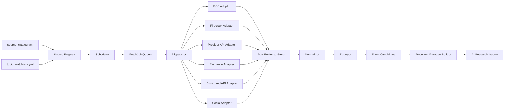

# 采集能力详细设计

## 架构目标

采集层负责把多源信息转成统一的、可追溯的研究材料。

核心原则：

- 源配置驱动，不在代码里硬编码来源。
- Adapter 驱动，同一类源复用同一采集能力。
- 证据优先，先保存原始证据，再做清洗分析。
- 全链路可追踪，从 AI 结论能回溯到原网页、原响应、原时间。
- 能宽覆盖，但不能无限抓取失控。

## 模块结构

```text
finbot/
  config/
    source_catalog.py
    topic_watchlist.py
    settings.py

  ingestion/
    models.py
    scheduler.py
    dispatcher.py
    registry.py
    adapters/
      base.py
      exchange_public_api.py
      structured_api.py
      rss.py
      firecrawl.py
      provider_api.py
      email_subscription.py
      social.py
    workers/
      worker_pool.py
      retry_policy.py
      domain_limiter.py

  normalization/
    document_normalizer.py
    url_normalizer.py
    dedupe.py
    event_candidate.py
    asset_mapper.py

  storage/
    sqlite_store.py
    evidence_store.py
    schema.sql

  research/
    package_builder.py

  cli/
    smoke_sources.py
    run_scheduler.py
```

## 数据流



## 核心模型

### SourceConfig

```python
class SourceConfig(BaseModel):
    id: str
    enabled: bool
    tier: str
    category: str
    mode: str
    provider: str | None = None
    trust_weight: float
    poll_interval: str
    priority: str
    asset_scope: list[str]
    feed_urls: list[str] = []
    seed_urls: list[str] = []
    search_queries: list[str] = []
    data_types: list[str] = []
    notes: str | None = None
```

### FetchJob

```python
class FetchJob(BaseModel):
    job_id: str
    source_id: str
    mode: str
    priority: str
    asset_scope: list[str]
    job_type: str
    url: str | None = None
    query: str | None = None
    provider: str | None = None
    scheduled_at: datetime
    timeout_ms: int = 60000
    max_results: int | None = None
    max_scrape_targets: int | None = None
```

### RawEvidence

```python
class RawEvidence(BaseModel):
    evidence_id: str
    source_id: str
    job_id: str
    fetched_at: datetime
    url: str | None
    query: str | None
    status_code: int | None
    success: bool
    request_path: str | None
    response_path: str | None
    headers_path: str | None
    markdown_path: str | None
    error: str | None
    metadata: dict
```

### NormalizedDocument

```python
class NormalizedDocument(BaseModel):
    document_id: str
    evidence_id: str
    source_id: str
    tier: str
    trust_weight: float
    canonical_url: str | None
    title: str | None
    published_at: datetime | None
    fetched_at: datetime
    language: str | None
    text: str
    content_hash: str
    entities: list[str]
    asset_scope: list[str]
    source_type: str
```

## Adapter 设计

### BaseAdapter

所有 adapter 返回统一结果：

```python
class AdapterResult(BaseModel):
    success: bool
    evidence: RawEvidence
    discovered_jobs: list[FetchJob] = []
    error: str | None = None
```

接口：

```python
class BaseAdapter(Protocol):
    mode: str

    async def fetch(self, job: FetchJob, source: SourceConfig) -> AdapterResult:
        ...
```

### exchange_public_api

覆盖：

- `market_bybit_public`
- `market_gate_public`

职责：

- 拉 ticker。
- 拉 kline。
- 拉 orderbook。
- 拉 recent trades。
- 拉 funding/open interest，如 provider 支持。

第一版：

- 使用 ccxt 做通用行情。
- Bybit/Gate 特殊字段后续用 pybit/gateapi-python 增强。

输出：

- `market_snapshot` 表。
- `raw_evidence` 保存原始 JSON。

### structured_api

覆盖：

- `official_fred_api`
- `official_bls_api`
- `official_bea_api`
- `official_sec_edgar_company_filings`
- 后续 EIA API

职责：

- 调用官方结构化接口。
- 标记 credential 状态。
- 保存原始 JSON。
- 转成宏观事件或数据点。

策略：

- 没 key 的源不报系统错误，标为 `blocked-by-credential`。
- BLS 如果公开 endpoint 可用，先用 keyless smoke。
- SEC 需要 User-Agent 和 CIK 列表，第一版可先配置禁用。

### rss / rss_then_firecrawl_scrape

覆盖：

- `official_federal_reserve`
- `official_ecb_rss`
- `official_state_department_rss`
- `official_defense_rss` when an accessible RSS URL is configured
- `official_cme_rss` when exact feed URLs are selected
- `official_govinfo_rss`

职责：

- 抓 RSS。
- 保存 feed 原始 XML。
- 提取 item URL。
- 如果模式是 `rss_then_firecrawl_scrape`，为每个 item 生成 Firecrawl scrape job。

策略：

- RSS 层轻量高频。
- 正文 scrape 层受域名限流。
- RSS item 先入候选库，避免重复抓正文。

### firecrawl_scrape

覆盖：

- `official_eia_weekly_petroleum`
- `official_opec_news`
- `official_white_house`
- `official_defense_rss`
- `official_cme_rss`
- `exchange_announcements_bybit`
- `exchange_announcements_gate`

职责：

- 固定 URL 抓取。
- 输出 Markdown。
- 保存 headers/response/markdown。
- 对页面内链接做可选浅层发现。

策略：

- 官方源低频、稳定。
- 默认 `max_depth=0`。
- 只有明确允许的页面才开启浅层发现。

### firecrawl_search / firecrawl_search_then_scrape

覆盖：

- `search_firecrawl_global`
- `news_reuters_search`
- `news_ap_search`
- `news_cnbc_search`
- `news_forexlive_search`
- `news_fxstreet_search`
- `news_oilprice_search`
- `news_coindesk_search`
- `news_cointelegraph_search`
- `news_decrypt_search`

职责：

- 根据 source search_queries 或 topic watchlist 生成搜索。
- 保存搜索结果。
- URL 候选打分。
- 生成 scrape jobs。

策略：

- query 按主题扩展，但每轮限制数量。
- `site:` 限域搜索优先用于权威新闻。
- 全局搜索只做补盲，不让低可信来源淹没系统。

### provider_api

覆盖：

- `news_yahoo_finance`
- `news_openbb_world`
- `news_alpha_vantage_sentiment`
- `search_gdelt_doc`

职责：

- 通过 SDK/API 获取新闻、行情或搜索结果。
- 保存 provider 原始响应。
- 能回溯原文 URL 的，继续生成 scrape job。
- GDELT 只负责发现 `articles` 列表；原文正文交给后续 `firecrawl_scrape` job。

策略：

- GDELT 作为全球新闻发现源。
- yfinance 用于股票/指数相关新闻。
- OpenBB 做统一 provider 抽象。
- Alpha Vantage 需要 key，默认 blocked。
- GDELT 对并发和频率敏感，调度上按低频源处理。

### email_subscription_then_firecrawl_scrape

覆盖：

- `official_us_treasury_sanctions`

职责：

- 本阶段不做真实邮箱接入。
- adapter 必须存在，但邮箱部分返回 `disabled-by-scope`。
- 同时使用 Recent Actions 页面做低频 Firecrawl/HTTP fallback。
- fallback 不依赖邮箱，也不能阻碍其他源。

### social_fetch

覆盖：

- 未来显式启用的社交 API 源

职责：

- 获取主题、ticker、关键词相关讨论。
- 只输出 social clue。
- 不直接生成 confirmed event。

策略：

- 社交源默认低权重。
- 可被公开抓取的社交页面优先走 `firecrawl_scrape` 或 `firecrawl_search_then_scrape`，不把第三方社交 API 作为第一依赖。

## 调度设计

### Job 优先级

| 优先级 | 类型 | 示例 |
| --- | --- | --- |
| P0 | 官方突发、日历事件、行情异常 | Fed、EIA、White House、Defense |
| P1 | 一线新闻和 Firecrawl 补盲 | Reuters、AP、CNBC、GDELT |
| P2 | 垂直媒体、社交、公司信息 | OilPrice、CoinDesk、StockTwits |
| P3 | 深度回填和背景材料 | 历史长文、研究补充 |

### 限流

必须有三层限流：

1. 全局限流：总并发、Firecrawl 预算。
2. Provider 限流：Bybit/Gate/FRED/GDELT 等。
3. Domain 限流：同域名并发和最短间隔。

### 失败处理

| 错误 | 策略 |
| --- | --- |
| 401/403 | 标记 auth 或 policy 问题，暂停源 |
| 404 | 标记 URL 无效，降低源优先级 |
| 429 | 指数退避，降低并发 |
| 5xx | 重试 3 次后冷却 |
| timeout | 标记 provider/network 非阻塞状态，降低 max_results 或延长间隔 |
| empty content | 降权，不进入 AI 输入包 |

## 存储设计

第一版使用：

```text
SQLite：索引、状态、任务、source health
Evidence 文件夹：原始 JSON、headers、markdown、XML
```

### 表

```sql
sources
fetch_jobs
fetch_runs
raw_evidence
normalized_documents
url_candidates
dedupe_keys
event_candidates
market_snapshots
source_health
research_packages
```

### Evidence 目录

```text
data/
  evidence/
    2026/
      07/
        08/
          source_id/
            job_id.request.json
            job_id.response.json
            job_id.headers.txt
            job_id.markdown.md
```

## Smoke Test 设计

命令：

```powershell
python -m finbot.cli.smoke_sources --catalog config/source_catalog.example.yml --limit-per-source 1
```

任务预览：

```powershell
python -m finbot.cli.plan_jobs --catalog config/source_catalog.example.yml --topics config/topic_watchlists.example.yml
```

执行一轮调度：

```powershell
python -m finbot.cli.run_once --source news_reuters_search --max-followup-jobs 2
```

证据归一化和研究包生成：

```powershell
python -m finbot.cli.process_evidence
python -m finbot.cli.build_research_package --time-window latest
```

采集层状态报告：

```powershell
python -m finbot.cli.status
```

输出：

```text
source_id                         status                   detail
market_bybit_public               smoke-tested             ticker ok
official_fred_api                 blocked-by-credential    FRED_API_KEY missing
news_reuters_search               smoke-tested             search ok, 1 scrape ok
social_stocktwits                  smoke-tested             Firecrawl scrape ok if symbol page is crawlable
```

同时写入：

```text
data/reports/source-smoke-report.json
data/reports/source-smoke-report.md
```

## 环境变量

```text
FIRECRAWL_API_BASE=https://api.firecrawl.dev/v2
FIRECRAWL_AUTH_MODE=keyless
FIRECRAWL_API_KEY=
FIRECRAWL_PROXY=
FIRECRAWL_PROXY_POOL=
FIRECRAWL_PROXY_FILE=config/firecrawl_proxies.txt
FIRECRAWL_PROXY_INCLUDE_DIRECT=0
FRED_API_KEY=
BEA_API_KEY=
ALPHA_VANTAGE_API_KEY=
OPENBB_PAT=
HTTP_USER_AGENT=FinBot research bot contact@example.com
```

缺少这些 key 时，adapter 必须返回 `blocked-by-credential`，并写入 key 清单，不能抛出未处理异常。

Firecrawl 默认使用 keyless 模式。`FIRECRAWL_API_KEY` 不是必需项，只是未来切到 bearer/key 模式时的可选配置。

认证模式：

```text
firecrawl_auth_mode = keyless | bearer
```

### Firecrawl 代理池

Firecrawl 必须使用代理池，避免所有搜索和抓取都从单一路径出去；执行层禁止 direct fallback。

支持三种配置：

```text
FIRECRAWL_PROXY=单个代理
FIRECRAWL_PROXY_POOL=多个代理，用逗号、分号或换行分隔
FIRECRAWL_PROXY_FILE=config/firecrawl_proxies.txt，一行一个代理
```

代理池规则：

- round-robin 轮询候选代理。
- 代理失败后尝试下一个候选。
- `FIRECRAWL_PROXY_INCLUDE_DIRECT` 默认值为 `0`；Firecrawl adapter 按项目策略强制禁用直连，即使运行时误设为 `1` 也不得裸连。
- evidence metadata 只记录脱敏后的代理，不保存用户名密码。
- 407、429、502、503、504 这类状态可触发代理候选切换。
- keyless 模式下尤其要配合代理池、请求预算和退避，否则容易出现 429。
- 对 `socks5://` 和 `socks5h://` 要区分清楚：`socks5://` 通常由客户端本地解析域名，目标可以是 IPv4；`socks5h://` / remote DNS 会让代理端解析域名，更适合真正的域名侧代理，但如果代理实现强制 IPv6 且目标域名没有 AAAA 记录，会直接失败。
- 当前 168.138.40.52 代理池在 `proxy_pool.py` 中对域名目标强制 `AF_INET6`，只有目标域名具备 IPv6 地址时才会使用随机 `2001:470:36:3ea::*` 出口；`api.firecrawl.dev` 当前只返回 IPv4 A 记录，因此 Firecrawl 配置应保持普通 `socks5://`，确保请求经过代理池，但不要把它误判为 Firecrawl 的 IPv6 出口。

## 第一版实现路线

### Step 1：基础骨架

- `pyproject.toml`
- `finbot/` 包
- 配置加载器
- Pydantic 模型
- SQLite 初始化
- evidence store

### Step 2：基础采集

- RSS adapter
- Firecrawl scrape adapter
- Firecrawl search adapter
- URL candidate store
- URL 去重

### Step 3：行情确认

- ccxt adapter
- Bybit/Gate ticker/kline smoke
- market snapshot 入库

### Step 4：Provider

- yfinance
- GDELT
- OpenBB 占位/可选
- Alpha Vantage credential block

### Step 5：结构化官方 API

- FRED
- BLS
- BEA
- SEC EDGAR

### Step 6：全源 smoke

- 按 source catalog 遍历所有源。
- 输出状态报告。
- 所有 blocked 源必须说明原因。

## 关键决策

- Python 是主采集语言。
- 第一版不用 Celery，先用 asyncio + APScheduler/自研轻量 scheduler。
- 第一版存储用 SQLite + 文件证据库。
- 不为了“接入全部源”写一套源一套爬虫，必须靠 adapter 抽象。
- 所有抓取都要先保存 raw evidence，再做解析。
- Firecrawl 是增强层，不是唯一入口。
- 社交源只作为 clue，不直接参与事实确认。
