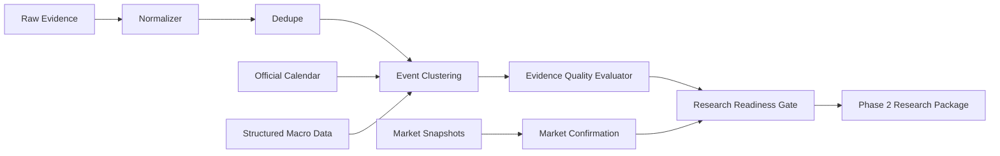

# Phase 2 详细设计：事件质量、确认、日历和研究就绪层

## 1. 阶段定位

Phase 1 已完成“信息源层”：

- 多源配置化采集。
- Firecrawl keyless + 代理池抓取。
- RSS、搜索、公开行情、结构化 API、社交源 adapter 骨架。
- 原始证据保存。
- 正文标准化、去重、URL 候选提取。
- 基础 event candidate 和 research input package。

Phase 2 不进入交易，也不直接生成买卖建议。它的目标是把“收集到的信息”变成“AI 可以放心研究的事件材料”。

一句话：

```text
Phase 1 解决有没有信息。
Phase 2 解决哪些信息值得研究、证据够不够、缺什么证据、是否已有行情确认。
```

## 2. 阶段目标

Phase 2 需要交付五类能力：

1. 事件聚类增强
   - 把同一主题、同一资产、同一时间窗口内的多篇证据聚成一个事件。
   - 避免把转载、搜索列表、官方首页误当成多个独立事件。

2. 证据质量评估
   - 区分 T1 官方、T2 主流新闻、T3 垂直媒体、T4 搜索发现、T5 社交情绪。
   - 识别索引页、landing page、正文过薄、跑题搜索结果、方向冲突。
   - 给出 `quality_score`、`confirmation_state`、`priority` 和 `review_flags`。

3. 官方日历和结构化事件
   - 接入 EIA、FOMC、BLS、BEA、FRED、SEC 等固定发布时间或结构化数据源。
   - 生成“预期发布事件”和“实际发布事件”。
   - 让 AI 能区分“定时数据发布”与“突发新闻”。

4. 市场确认层
   - 把事件映射到相关资产。
   - 在事件前后抓取行情快照。
   - 不输出交易动作，只输出“市场是否已经反应”和“需要关注的联动资产”。

5. 研究输入包升级
   - 输出更完整的 AI research package。
   - 每个事件必须携带来源链、质量标记、行情上下文、待补证据和禁用动作约束。

## 3. 不在本阶段范围

Phase 2 不做：

- 不自动交易。
- 不接交易权限 API。
- 不训练机器学习模型。
- 不把 sentiment score 当作交易信号。
- 不生成最终研报长文，这是 Phase 3。
- 不做复杂 embedding 聚类，先用规则 + 可审计特征。

## 4. 总体架构



Phase 2 新增逻辑不替代 Phase 1，而是接在 `normalized_documents` 之后。

## 5. 模块划分

建议模块结构：

```text
finbot/
  calendar/
    economic_calendar.py
    official_release_registry.py
    release_matcher.py

  clustering/
    event_clusterer.py
    anchor_terms.py
    time_window.py

  quality/
    event_quality.py
    source_reliability.py
    topic_relevance.py
    conflict_detector.py

  market/
    snapshot_builder.py
    confirmation.py
    asset_mapper.py

  research/
    package_builder.py
    readiness_gate.py

  cli/
    build_phase2_package.py
    inspect_event_quality.py
    run_calendar_once.py
    run_market_confirmation.py
```

当前已经有：

- `finbot.quality.event_quality.EventQualityEvaluator`
- `finbot.normalization.evidence_processor`
- `finbot.research.package_builder`

后续开发优先在这些模块上增量扩展。

## 6. 数据流

### 6.1 标准化输入

Phase 2 从 `normalized_documents` 读取：

- `document_id`
- `evidence_id`
- `source_id`
- `tier`
- `category`
- `trust_weight`
- `canonical_url`
- `title`
- `published_at`
- `fetched_at`
- `language`
- `text`
- `content_hash`
- `title_key`
- `asset_scope_json`
- `metadata_json`

### 6.2 事件聚类

聚类分三层：

1. 硬去重
   - `content_hash`
   - `canonical_url`
   - `title_key`

2. 主题锚点
   - `category_family`
   - `asset_anchor`
   - `event_anchor_terms`

3. 时间窗口
   - 突发新闻：6-12 小时窗口。
   - 官方发布：按 `release_id` 和发布日期合并。
   - 背景材料：24-72 小时窗口。

第一版 event key：

```text
category_family:asset_anchor:event_anchor_terms
```

后续增强 event key：

```text
category_family:asset_anchor:event_anchor_terms:time_bucket[:release_id]
```

### 6.3 质量评估

每个 event cluster 输出：

```json
{
  "quality_score": 0.74,
  "confirmation_state": "likely",
  "priority": "P1",
  "evidence_tiers": {"T1": 1, "T2": 2},
  "source_categories": {"energy": 1, "broad_market_news": 2},
  "average_trust_weight": 0.78,
  "market_confirmation": {},
  "conflict_flags": [],
  "review_flags": ["single_source"],
  "suggested_followups": []
}
```

### 6.4 研究就绪门禁

AI 研究层不应该接收一堆无差别文本。Phase 2 需要给每个事件一个进入等级：

| 等级 | 含义 | AI 处理方式 |
|---|---|---|
| `research-ready` | 证据质量足够，有主来源，有行情上下文 | 可以生成事件研究卡片 |
| `needs-corroboration` | 事件可能重要，但缺独立确认 | 先触发补证据任务 |
| `watch-only` | 有观察价值，但弱证据或社交/搜索为主 | 只进入观察队列 |
| `discard-or-background` | 跑题、索引页、重复内容、正文太薄 | 不进入 AI 主研究包 |

## 7. 数据模型设计

### 7.1 event_clusters

当前已有 `event_candidates`，Phase 2 后续建议升级为 `event_clusters`。

```sql
create table if not exists event_clusters (
  cluster_id text primary key,
  event_key text not null,
  title text not null,
  category_family text not null,
  asset_anchor text not null,
  event_anchor_terms_json text not null,
  asset_scope_json text not null,
  document_ids_json text not null,
  source_ids_json text not null,
  source_tiers_json text not null,
  confidence real not null,
  quality_score real not null,
  priority text not null,
  confirmation_state text not null,
  research_readiness text not null,
  first_seen_at text not null,
  last_seen_at text not null,
  summary text,
  metadata_json text not null
);
```

兼容策略：

- 近期继续写 `event_candidates`。
- 增强字段先放 `metadata_json`。
- 稳定后迁移成独立 `event_clusters` 表。

### 7.2 official_release_calendar

```sql
create table if not exists official_release_calendar (
  release_id text primary key,
  provider text not null,
  release_type text not null,
  title text not null,
  scheduled_at text not null,
  timezone text,
  asset_scope_json text not null,
  expected_fields_json text not null,
  source_url text,
  status text not null,
  metadata_json text not null
);
```

示例 release：

- `eia_weekly_petroleum_status`
- `fomc_rate_decision`
- `fomc_minutes`
- `bls_cpi`
- `bls_nonfarm_payrolls`
- `bea_gdp`
- `fred_dgs10`
- `sec_10q_10k_filings`

### 7.3 market_context_snapshots

```sql
create table if not exists market_context_snapshots (
  snapshot_id text primary key,
  cluster_id text,
  asset text not null,
  provider text not null,
  captured_at text not null,
  window_start text,
  window_end text,
  price_before real,
  price_after real,
  price_change_pct real,
  volume_change_pct real,
  volatility_proxy real,
  raw_document_ids_json text not null,
  metadata_json text not null
);
```

### 7.4 source_budget_state

```sql
create table if not exists source_budget_state (
  source_id text primary key,
  provider text,
  budget_window text not null,
  requests_used integer not null,
  credits_used real not null,
  max_requests integer,
  max_credits real,
  throttled_until text,
  last_error text,
  updated_at text not null
);
```

## 8. 事件质量算法

### 8.1 质量分

当前公式保持可解释：

```text
quality_score =
  source_trust * 0.52
  + source_diversity_bonus
  + document_count_bonus
  + t1_official_bonus
  + market_confirmation_bonus
  + freshness_bonus
  - conflict_penalty
  - generic_page_penalty
  - weak_topic_match_penalty
```

后续增加：

- `official_calendar_match_bonus`
- `structured_data_present_bonus`
- `social_only_penalty`
- `stale_event_penalty`
- `syndicated_duplicate_penalty`

### 8.2 confirmation_state

```text
confirmed-by-official-and-secondary:
  至少 1 个 T1 来源 + 至少 1 个独立 T2/T3 来源。

official-only:
  有 T1 来源，但缺二级来源。

secondary-confirmed:
  多个 T2/T3 来源一致，但没有 T1。

market-context-ready:
  证据一般，但已有行情上下文，可给 AI 低置信研究。

watch:
  有事件苗头，需要补证据。

weak:
  弱证据、跑题、landing page、正文太薄。
```

### 8.3 review_flags

必须支持这些 flag：

- `single_source`
- `no_t1_official_confirmation`
- `generic_landing_or_index_page`
- `weak_topic_match`
- `thin_content`
- `missing_market_confirmation`
- `needs_conflict_review`
- `social_only`
- `structured_release_without_market_context`
- `official_calendar_missed`
- `provider_rate_limited`

### 8.4 suggested_followups

每个 flag 要能映射到下一步动作：

| flag | follow-up |
|---|---|
| `single_source` | 搜索同主题独立来源 |
| `no_t1_official_confirmation` | 优先抓官方源或一级公告 |
| `generic_landing_or_index_page` | 从页面提取详情 URL 并 Firecrawl 抓正文 |
| `weak_topic_match` | 丢弃或降低优先级，避免误入 AI 分析 |
| `missing_market_confirmation` | 抓取相关资产事件前后行情 |
| `needs_conflict_review` | 标记冲突点，要求 AI 不做单边结论 |
| `official_calendar_missed` | 检查日历源或发布时间配置 |

## 9. 官方日历设计

### 9.1 日历来源

第一批日历：

- EIA Weekly Petroleum Status Report
- FOMC rate decision
- FOMC minutes
- BLS CPI
- BLS Nonfarm Payrolls
- BEA GDP / PCE
- FRED 关键序列更新
- SEC 重点公司 10-K / 10-Q / 8-K

### 9.2 日历事件状态

```text
scheduled -> due-soon -> collecting -> released -> matched -> stale/missed
```

### 9.3 匹配逻辑

官方日历发布后，用以下信息匹配证据：

- provider。
- release_type。
- scheduled_at 附近窗口。
- source URL。
- 标题关键词。
- 结构化数据字段。

匹配成功后，将普通 event candidate 提升为 official release event。

## 10. 结构化数据增强

结构化数据不应该直接变成长文本。要转为标准事实包：

```json
{
  "type": "macro_release",
  "provider": "bls",
  "release_type": "cpi",
  "observed_at": "2026-07-08T12:30:00Z",
  "fields": {
    "headline_cpi_yoy": null,
    "core_cpi_yoy": null
  },
  "surprise": {
    "actual": null,
    "consensus": null,
    "previous": null
  },
  "asset_scope": ["NAS100", "XAUUSD", "DXY", "BTCUSDT"]
}
```

没有 consensus 时也可以先输出 actual / previous，并标记 `missing_consensus`。

## 11. 市场确认设计

### 11.1 资产映射

事件到资产需要有显式映射：

| 事件主题 | 主资产 | 联动资产 |
|---|---|---|
| 原油库存、OPEC、制裁 | `XTIUSD`, `USOIL` | `XAUUSD`, `DXY`, `NAS100` |
| Fed、CPI、PCE、非农 | `NAS100`, `XAUUSD`, `DXY` | `BTCUSDT`, `XAGUSD` |
| SEC、ETF、交易所安全 | `BTCUSDT`, `ETHUSDT` | `NAS100` |
| 战争、制裁、航运 | `XTIUSD`, `XAUUSD` | `DXY`, `NAS100` |
| AI 芯片、科技财报 | `NAS100` | `BTCUSDT`, `DXY` |

### 11.2 快照窗口

```text
pre_event_window: 30m / 1h / 4h
post_event_window: 15m / 1h / 4h
```

第一版只做 latest snapshot，不追求严谨回测。

### 11.3 输出字段

```json
{
  "asset": "XTIUSD",
  "status": "available",
  "latest_market_seen_at": "...",
  "price_change_pct": null,
  "volume_change_pct": null,
  "volatility_proxy": null,
  "note": "Public market data snapshot only; not a trading signal."
}
```

## 12. 社交和预测市场设计

### 12.1 StockTwits

定位：情绪温度，不是事实源。

采集字段：

- symbol。
- message count。
- bullish / bearish 标签。
- engagement。
- top messages。
- fetched_at。

输出到事件时：

```json
{
  "social_context": {
    "provider": "stocktwits",
    "symbol": "BTC.X",
    "message_count": 120,
    "sentiment_hint": "mixed",
    "sample_size": 30,
    "trust_policy": "opinion-only"
  }
}
```

### 12.2 Polymarket

定位：事件概率和市场隐含预期，不是事实源。

适合主题：

- 降息。
- 战争升级。
- 选举。
- 衰退。
- ETF 通过。

输出：

```json
{
  "prediction_market_context": {
    "provider": "polymarket",
    "market_title": "...",
    "probability": 0.42,
    "liquidity": null,
    "matched_event_terms": ["rate cut"]
  }
}
```

## 13. Firecrawl 预算和限流

Phase 2 必须有预算控制，否则广覆盖会失控。

### 13.1 预算层级

- 全局 daily credit budget。
- provider daily request budget。
- source per-run page budget。
- domain concurrency。
- URL retry budget。

### 13.2 调度策略

优先级：

```text
P0 official detail page
P1 high-quality secondary confirmation
P2 topic补盲
P3 background crawl
```

当预算不足：

- 保留 T1 官方源。
- 保留已出现 P1/P0 事件的补证据抓取。
- 暂停普通 search discovery。
- 暂停社交补充。

## 14. Research Package v2

Phase 2 输出：

```json
{
  "generated_at": "...",
  "time_window": "latest",
  "quality_summary": {},
  "research_ready_events": [],
  "needs_corroboration_events": [],
  "watch_only_events": [],
  "discarded_or_background_events": [],
  "market_context": {},
  "source_health": {},
  "budget_state": {},
  "constraints": {
    "no_trading": true,
    "no_order_execution": true,
    "sentiment_is_not_signal": true
  }
}
```

现有 `event_candidates` 可以先继续平铺输出，但后续要增加按 readiness 分组。

### 14.1 Source Layer 到 AI Research Layer 的信息压缩

需要引入 AI 辅助压缩，但必须放在可审计链路里：

```text
Raw Evidence -> Normalized Document -> Structured Facts -> Deterministic Compression Plan -> Optional AI Compression -> AI Research
```

原则：

- 原始证据、normalized document、macro facts、market snapshots 始终是事实源。
- AI 压缩只是“上下文压缩器”，不能新增事实。
- AI 压缩结果必须携带 `evidence_id` / `document_id` / `event_id` 引用。
- 优先做确定性结构化抽取，再让 AI 压缩长文和多文档事件。
- 对 P0/P1/P2 事件，AI 可以生成 cluster summary，但必须保留冲突点和缺证据标记。

当前实现先输出 `compression_plan`，只标记哪些文档/事件适合 AI 压缩，不进行真实 LLM 调用。

### 14.2 AI compression provider 接入

当前实现已经把 `compression_plan` 后面的可选 AI compression worker 接入为独立层：

```text
compression_plan -> AICompressionRunner -> OpenAI-compatible provider -> ai_compressions -> Research Package v2
```

实现原则：

- 只支持 OpenAI-compatible `chat/completions` 和 `responses` 协议簇。
- 不引入 provider 专用 SDK。
- provider key 只从环境变量或 `AI_PROVIDER_KEYS_FILE` 指向的本地密钥文件读取。
- 不打印、不写入 research package、不持久化 API key。
- `ai_compressions` 保存 `target_type`、`target_id`、`provider`、`protocol`、`model`、`prompt_hash`、`source_refs`、`summary_json` 和失败摘要。
- AI compression 输出只作为 context compression，不作为事实源；事实源仍然是 raw evidence、normalized document、structured facts、market snapshots。

Provider 默认：

| provider | key env | base URL | chat model | responses model |
|---|---|---|---|---|
| DeepSeek | `DEEPSEEK_API_KEY` | `DEEPSEEK_BASE_URL`，默认 `https://api.deepseek.com` | `DEEPSEEK_CHAT_MODEL`，默认 `deepseek-v4-flash` | `DEEPSEEK_RESPONSES_MODEL`，默认不启用 |
| MiMo | `MIMO_API_KEY` | `MIMO_BASE_URL`，默认 `https://api.xiaomimimo.com/v1` | `MIMO_CHAT_MODEL`，默认 `mimo-v2.5-pro` | `MIMO_RESPONSES_MODEL`，默认 `mimo-v2.5-pro` |

本地默认密钥文件：

```text
D:\WorkSpace\Project\服务器管理\private\ai-providers\keys.env
```

该文件目前只承载 provider key。DeepSeek / MiMo 的 endpoint 和 model 默认值来自官方 API 文档，也可以通过环境变量覆盖。

协议细节：

- DeepSeek 官方文档提供 OpenAI-compatible Chat Completions；当前不默认启用 Responses。
- MiMo 官方文档提供 OpenAI-compatible Chat Completions 和 Responses。
- Chat 请求对 DeepSeek / MiMo 默认附加 `thinking: {"type": "disabled"}`，因为本层目标是上下文压缩，不需要 reasoning 展开。
- MiMo Responses 请求默认附加 `reasoning: {"effort": "none"}`。

验收命令：

```powershell
python -m finbot.cli.run_ai_compression --dry-run
python -m finbot.cli.run_ai_compression --provider deepseek --protocol chat --limit-documents 1 --limit-events 0
python -m finbot.cli.build_phase2_package --time-window phase2-ai-compression
```

## 15. CLI 验收命令

Phase 2 每个增量都要能通过 CLI 验收：

```powershell
python -m compileall finbot
python -m finbot.cli.process_evidence
python -m finbot.cli.build_research_package --time-window phase2-quality-v1
python -m finbot.cli.status
```

后续新增：

```powershell
python -m finbot.cli.run_calendar_once
python -m finbot.cli.run_market_confirmation
python -m finbot.cli.inspect_event_quality --top 20
python -m finbot.cli.build_phase2_package
```

## 16. 验收标准

Phase 2 详细验收标准：

1. 事件聚类
   - 同一 URL、同一标题、同一正文不重复进入事件。
   - 同主题多来源能合并。
   - 搜索结果列表、landing page 不会被误判为高优先级事件。

2. 质量评分
   - 每个事件都有 `quality_score`、`priority`、`confirmation_state`。
   - 至少支持 8 个以上 review flag。
   - P0/P1 不允许主要由 `weak_topic_match` 或 `generic_landing_or_index_page` 构成。

3. 官方日历
   - 至少接入 4 类固定发布：EIA、FOMC、BLS、BEA/FRED。
   - 能生成 scheduled release。
   - 能把实际抓到的官方证据匹配到 scheduled release。

4. 市场确认
   - 每个 P0/P1 事件必须尝试抓行情上下文。
   - 缺行情时必须标记 `missing_market_confirmation`。

5. Research Package
   - AI 输入包按 readiness 分组。
   - 所有事件都能回溯 `document_ids`、`source_ids`、`evidence_id`。
   - 包内明确写入 no trading 约束。

6. 运行稳定性
   - 缺 key 不阻塞全局流程。
   - provider 429 / 403 不造成任务崩溃。
   - Firecrawl 预算不足时能降级。

## 17. 开发顺序

建议按这个顺序推进：

1. 完善质量层
   - 独立 `inspect_event_quality` CLI。
   - 更多 review flag。
   - readiness 分组。

2. 官方日历
   - `official_release_calendar` 表。
   - 手写第一批 release registry。
   - `run_calendar_once`。

3. 市场确认
   - `market_context_snapshots` 表。
   - 事件到资产映射。
   - `run_market_confirmation`。

4. 结构化宏观
   - FRED、BLS、BEA、EIA 字段标准化。
   - macro release facts。

5. 社交和预测市场
   - StockTwits 情绪温度。
   - Polymarket 概率上下文。

6. 预算和限流
   - `source_budget_state`。
   - Firecrawl per-source budget。
   - provider backoff。

7. Research Package v2
   - readiness 分组。
   - constraints。
   - source health + budget state 合并输出。

## 18. 当前 Phase 2 v1 状态

当前已经完成：

- `EventQualityEvaluator`。
- `quality_summary`。
- `priority`。
- `confirmation_state`。
- `market_confirmation` 基础结构。
- `generic_landing_or_index_page` 降权。
- `weak_topic_match` 降权。
- 事件 key 从标题去重升级为主题锚点。
- `ResearchReadinessGate`。
- Research Package v2 readiness 分组。
- `inspect_event_quality` CLI。
- `build_phase2_package` CLI。
- `official_release_calendar` 表。
- `run_calendar_once` CLI。
- `config/official_release_calendar.example.yml` 示例官方日历。
- Phase 2 package 输出 `official_calendar`。
- `market_context_snapshots` 表。
- `run_market_confirmation` CLI。
- Phase 2 package 输出 `market_context_snapshots`。
- Phase 2 package 输出 `compression_plan`，作为后续 AI 辅助压缩入口。
- `ai_compressions` 表。
- `run_ai_compression` CLI。
- DeepSeek / MiMo OpenAI-compatible provider 配置层。
- Phase 2 package 输出 `ai_compressions`。
- `macro_release_facts` 表。
- `run_macro_facts` CLI。
- `plan_corroboration` CLI。
- `source_budget_state` 表。
- `update_budget_state` CLI。

当前验证结果：

```text
event_candidates: 39
P1: 2
P2: 7
P3: 30
likely: 2
watch: 5
weak: 32
official_release_calendar: 5
market_context_snapshots: 9
macro_release_facts: 7
queued-corroboration jobs: 12
source_budget_state: 33
compression_plan:
  document_candidates: 49
  event_candidates: 8
  ai_assisted_compression_recommended: true
readiness:
  research-ready: 0
  needs-corroboration: 5
  watch-only: 5
  discard-or-background: 29
```

这说明质量层已经开始把官方列表页、跑题搜索结果、弱证据事件压到低优先级，并且官方日历、宏观事实、基础市场确认、补证据队列、预算状态和压缩计划已经进入 Phase 2 package。

下一步应该优先做：

1. 执行 `queued-corroboration` jobs，补齐 P1/P2 事件的独立证据。
2. 接真实 FRED / BEA key 后扩展 macro facts。
3. 接入 AI compression worker，但保持“原始证据是事实源、AI 只压缩和重排上下文”的边界。
