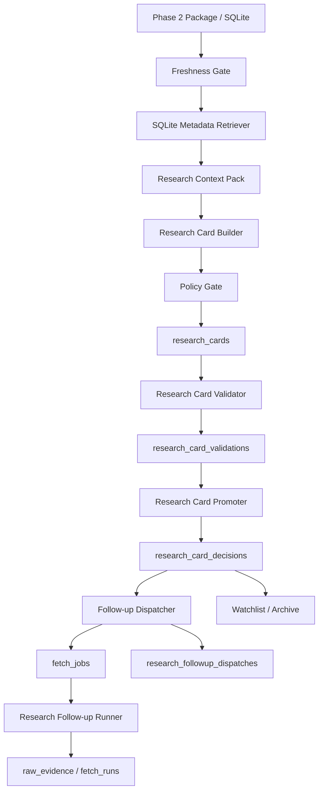

# Phase 3 设计：AI Research Layer v1

## 1. 阶段定位

Phase 3 接在 Phase 2 后面，不重新采集信息，也不直接生成交易建议。

一句话：

```text
Phase 2 解决材料是否可信、够不够。
Phase 3 解决如何把材料整理成可审计、可复核、可跟进的研究卡片。
```

## 2. 核心决策

当前阶段不引入重型 RAG / 向量库。

原因：

- 当前数据规模仍适合 SQLite metadata retriever。
- 金融新闻强时效，普通旧新闻对当前市场影响通常很弱。
- 当前主要风险是证据链、时效、越界结论和 AI compression 幻觉，而不是向量召回性能。
- 先稳定 `ResearchContextPack` / `ResearchCard` 契约，后续再替换底层检索实现。

保留的扩展边界：

```text
SQLiteResearchContextRetriever
  -> Future FTS Retriever
  -> Future Vector Retriever
```

## 3. 总体架构



## 4. Freshness Gate

默认策略是强时效优先：

- `social` / `social_fetch`: 6 小时。
- `market_data`: 24 小时。
- `broad_market_news` / `crypto_news` / `energy_news` / `macro_market_news`: 72 小时。
- `macro_data` / `official` / `policy`: 168 小时。
- `filing`: 720 小时。

分类：

| 状态 | 用途 |
|---|---|
| `fresh` | 可进入主证据链 |
| `stale-context` | 只能作为背景 |
| `discarded-stale` | 不进入主卡片论证，只保留引用 |

原则：

- 普通旧新闻默认不影响当前研究结论。
- T1 官方来源和宏观/文件类材料可以作为更长周期背景。
- Freshness Gate 不删除数据，只决定它在研究卡片中的位置。

## 5. Research Context Pack

每个事件先组装成 `ResearchContextPack`：

```json
{
  "event": {},
  "freshness_policy": {},
  "fresh_evidence": [],
  "stale_context": [],
  "discarded_stale_refs": [],
  "macro_context": [],
  "market_context": [],
  "ai_compressions": [],
  "missing_context": []
}
```

上下文来源：

- `event_candidates`
- `normalized_documents`
- `macro_release_facts`
- `market_context_snapshots`
- `ai_compressions`

## 6. Research Card

`ResearchCard` 是 Phase 3 的稳定产物：

```json
{
  "card_id": "...",
  "event_id": "...",
  "readiness": "needs-corroboration",
  "freshness_status": "fresh",
  "headline": "...",
  "summary": "...",
  "fresh_evidence": [],
  "stale_context": [],
  "discarded_stale_refs": [],
  "evidence_assessment": {},
  "macro_context": [],
  "market_context": [],
  "ai_compression_refs": [],
  "impact_channels": [],
  "counter_arguments": [],
  "missing_evidence": [],
  "follow_up_jobs": [],
  "source_refs": [],
  "policy_flags": []
}
```

## 7. 研究委员会映射

第一版不做自由 Agent swarm，而是 deterministic analyst modules：

| 模块 | 职责 |
|---|---|
| `FreshnessGate` | 判断主证据、背景、过时引用 |
| `SQLiteResearchContextRetriever` | 组装事件上下文 |
| `ResearchCardBuilder` | 生成研究卡片 |
| `EvidenceAssessment` | 汇总质量分、来源层级、review flags |
| `CounterArguments` | 汇总反方意见和风险 |
| `PolicyGate` | 阻止交易动作和越界结论 |
| `ResearchCardValidator` | 验证引用链、时效门禁、policy flags 和 AI compression 边界 |
| `ResearchCardPromoter` | 对已验证卡片做研究流转决策 |
| `ResearchFollowupDispatcher` | 将 follow-up 决策转换成可执行 `fetch_jobs` |
| `ResearchFollowupRunner` | 只执行 `queued-research-followup` 队列 |

后续如果要引入真实 Agent，可以把这些模块变成 analyst roles，但 `ResearchCard` 契约不变。

## 8. 数据模型

```sql
create table if not exists research_cards (
  card_id text primary key,
  event_id text not null,
  event_key text not null,
  readiness text not null,
  priority text,
  freshness_status text not null,
  time_window text not null,
  payload_json text not null,
  created_at text not null
);
```

```sql
create table if not exists research_card_validations (
  validation_id text primary key,
  card_id text not null,
  event_id text not null,
  status text not null,
  score real not null,
  findings_json text not null,
  created_at text not null
);
```

```sql
create table if not exists research_card_decisions (
  decision_id text primary key,
  card_id text not null,
  event_id text not null,
  decision text not null,
  score real not null,
  payload_json text not null,
  created_at text not null
);
```

```sql
create table if not exists research_followup_dispatches (
  dispatch_id text primary key,
  decision_id text not null,
  card_id text not null,
  event_id text not null,
  job_id text not null,
  status text not null,
  payload_json text not null,
  created_at text not null
);
```

## 9. Research Card Validation

`ResearchCardValidator` 是工程验收门，不做主观投资判断。

检查项：

- card payload 必填字段。
- `event_id` 是否仍能回到 `event_candidates`。
- `document_id` / `evidence_id` / `source_id` 是否存在。
- `ai_compression_refs` 是否存在，且 `trust_policy=context-compression-only`。
- `fresh_evidence` / `stale_context` / `discarded_stale_refs` 与 freshness status 是否自洽。
- `policy_flags` 是否完整。
- `policy_gate` 是否通过。
- headline / summary / counter arguments 是否含交易动作禁词。

状态：

| 状态 | 含义 |
|---|---|
| `passed` | 无 error / warning |
| `warning` | 有非阻断问题，例如缺市场上下文 |
| `failed` | 有阻断问题，例如引用断链或 policy gate 未通过 |

## 10. Research Card Promotion

`ResearchCardPromoter` 消费验证状态为 `passed` 或 `warning` 的卡片，输出研究工作流处置，不生成交易动作。

决策类型：

| 决策 | 含义 |
|---|---|
| `active-watch` | 进入研究观察队列 |
| `needs-followup` | 先触发补证据或补市场上下文 |
| `manual-review` | 有非阻断警告，需要人工复核 |
| `archive-background` | 只作为背景归档 |

评分因素：

- validation score。
- event quality score。
- priority。
- readiness。
- freshness status。
- market context 是否存在。
- missing evidence 数量。
- AI compression 是否存在。

约束：

- 只处理 `passed` / `warning` 卡片。
- `needs-corroboration` 不会被自动升级成 `research-ready`。
- 输出 `watchlist_tags` 和 `follow_up_jobs`，但不输出买卖、仓位或价格动作。

## 11. Follow-up Dispatch

`ResearchFollowupDispatcher` 将 `research_card_decisions` 中的 `follow_up_jobs` 转换成已有 ingestion 层可执行的 `fetch_jobs`。

规则：

- 只处理 `needs-followup` / `manual-review`。
- 只入队，不直接执行网络请求。
- 证据类 follow-up 入队到 `search_firecrawl_global`，job type 为 `firecrawl_search_then_scrape`。
- 行情类 follow-up 入队到 `market_bybit_public`，job type 为 `exchange_public_api`。
- `fetch_jobs.status=queued-research-followup`。
- `job_id` 由 card/detail 生成稳定 hash，重复运行不会膨胀队列。

## 12. Follow-up Runner

`ResearchFollowupRunner` 复用现有 ingestion `Dispatcher` 和 adapter，只执行 `fetch_jobs.status=queued-research-followup` 的任务。

特性：

- 支持 `--dry-run` 预览队列。
- 支持 `--max-jobs` 限制根任务数量。
- 支持 `--max-discovered-jobs` 限制 search 之后的 scrape 详情页执行数量。
- 执行结果写回 `raw_evidence`、`fetch_runs`、`source_health`。
- 不运行普通 source scheduler。
- P3.5 后会在执行前检查 `source_budget_state`，处于 `budget-exhausted` / `throttled` 且未过期的 source 会被跳过。
- P3.5 后遇到 Firecrawl 429、代理池失败或 provider block，会写入短期 `throttled_until`，避免同批任务连续撞墙。
- 可通过 `run_research_followups --rebuild-after-run` 在补证据执行后触发 ResearchCard rebuild / validation / promotion。

## 13. Phase 3.5 加固

P3.5 不改变 P3 的研究边界，只增强运行质量。

已加固项：

- Firecrawl 必须使用 `config/firecrawl_proxies.txt` 或环境变量中的代理池；执行层禁止 direct fallback。
- `config/firecrawl_proxies.txt` 是私有忽略文件，不写入仓库。
- Follow-up dispatch 会清理旧的 `queued-research-followup` 队列，避免历史脏任务抢跑。
- Follow-up query 会过滤 `needs-followup`、`needs-corroboration`、`fresh`、priority、资产标签和 channel 标签。
- 官方确认类 follow-up 优先分流到 T1 official source，例如 EIA / Federal Reserve。
- 独立二次来源类 follow-up 分流到 Reuters / CNBC / Coindesk 等 source，而不是全部压到 `search_firecrawl_global`。
- `fetch_jobs` 持久化 `max_results` / `max_scrape_targets`，保证低 fan-out 设置不会在入库后丢失。
- Runner 对 provider block / 429 / proxy failure 写入 `source_budget_state.throttled_until`。

## 14. 验收命令

```powershell
python -m compileall finbot
python -m finbot.cli.build_research_cards --time-window phase3-v1 --limit-events 10
python -m finbot.cli.validate_research_cards
python -m finbot.cli.promote_research_cards
python -m finbot.cli.dispatch_research_followups
python -m finbot.cli.run_research_followups --dry-run --max-jobs 3
python -m finbot.cli.run_research_followups --max-jobs 2 --max-discovered-jobs 1 --max-discovered-per-result 1 --rebuild-after-run
python -m finbot.cli.status
```

## 15. 当前状态

已实现：

- `FreshnessGate`
- `SQLiteResearchContextRetriever`
- `ResearchContextPack`
- `ResearchCardBuilder`
- `ResearchCardValidator`
- `ResearchCardPromoter`
- `ResearchFollowupDispatcher`
- `ResearchFollowupRunner`
- `research_cards` 表
- `research_card_validations` 表
- `research_card_decisions` 表
- `research_followup_dispatches` 表
- `build_research_cards` CLI
- `validate_research_cards` CLI
- `promote_research_cards` CLI
- `dispatch_research_followups` CLI
- `run_research_followups` CLI
- P3.5 follow-up query cleaner
- P3.5 provider/source routing
- P3.5 runner budget/backoff
- P3.5 follow-up 后 rebuild/validate/promote 钩子

当前边界：

- 不做交易建议。
- 不引入向量库。
- AI compression 只作为上下文摘要，不覆盖证据链。
- 旧新闻默认降为背景或过时引用。
