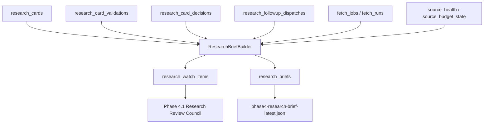

# Phase 4 设计：Research Operations Briefing

## 1. 阶段定位

Phase 4 接在 Phase 3 / 3.5 后面，不重新判断事实，不生成交易建议。

一句话：

```text
Phase 3 解决每个事件如何形成可审计研究卡片。
Phase 4 解决研究团队今天该看什么、补什么、等什么、归档什么。
```

P4 的产物是：

- `ResearchWatchItem`：每张研究卡片的运营视图。
- `ResearchBrief`：一次研究简报快照。
- `OperatorActions`：面向人或调度器的下一步工作流任务。

## 2. 边界

P4 仍然是 research-only：

- 不输出买卖动作。
- 不输出仓位、止损、止盈、目标价。
- 不输出价格预测。
- 不接交易权限 API。
- 不绕过 `ResearchCardValidator` / `ResearchCardPromoter`。

P4 允许输出：

- 哪些卡片需要补证据。
- 哪些卡片进入观察队列。
- 哪些 source 缺 key、被 provider block 或处于退避。
- 哪些 follow-up 队列需要小批量执行。
- 哪些卡片需要人工复核。

## 3. 总体架构



## 4. ResearchWatchItem

`ResearchWatchItem` 是单张卡片的运营状态。

核心字段：

- `card_id`
- `event_id`
- `event_key`
- `headline`
- `decision`
- `status`
- `priority`
- `score`
- `readiness`
- `freshness_status`
- `validation_status`
- `impact_channels`
- `evidence_summary`
- `research_risks`
- `followup`
- `next_action`

状态映射：

| P3 decision | P4 status |
|---|---|
| `active-watch` | `active-watch` |
| `needs-followup` | `pending-followup` |
| `manual-review` | `manual-review` |
| `archive-background` | `background-archive` |

## 5. ResearchBrief

`ResearchBrief` 是一次 P4 快照，包含：

- `summary`
- `watch_items`
- `followup_queue`
- `source_blockers`
- `budget_state`
- `operator_actions`
- `policy_flags`
- `policy_gate`

`policy_gate` 会扫描简报中的 headline、next action、operator actions 和 research risks，阻止交易动作词进入最终 payload。

P4 的 `research_watch_items` 是 P4.1 `ResearchReviewCouncil` 的输入；P4.1 负责多角色复核、讨论和 chair consensus，不改变 P4 的 deterministic briefing 职责。

## 6. 数据模型

```sql
create table if not exists research_watch_items (
  watch_item_id text primary key,
  card_id text not null,
  event_id text not null,
  decision text not null,
  priority text,
  score real not null,
  status text not null,
  payload_json text not null,
  created_at text not null
);
```

```sql
create table if not exists research_briefs (
  brief_id text primary key,
  time_window text not null,
  payload_json text not null,
  created_at text not null
);
```

## 7. 验收命令

```powershell
python -m compileall finbot
python -m finbot.cli.build_phase4_brief --clear-existing
python -m finbot.cli.status
```

## 8. 当前状态

已实现：

- `ResearchBriefBuilder`
- `research_watch_items` 表
- `research_briefs` 表
- `build_phase4_brief` CLI
- `status` 统计 P4 表

当前边界：

- P4 只消费 P3/P3.5 结果。
- P4 不做事实重判。
- P4 不做交易建议。
