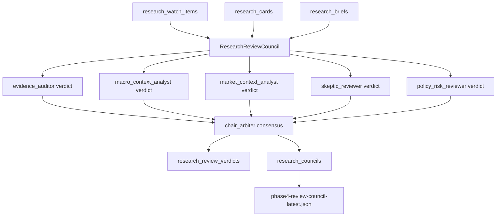

# Phase 4.1 设计：Research Review Council

## 1. 阶段定位

P4.1 是 P4 之后的多角色研究复核层。

它的目标不是生成交易建议，而是把 P4 `research_watch_items` 交给多个 deterministic reviewer modules 做交叉验证、质疑和仲裁，输出可审计的 council verdict。

P4.1 的输出只表达研究工作流状态：

- `watch-approved`
- `needs-followup`
- `manual-review`
- `archive-background`
- `blocked-by-policy`

## 2. 边界

P4.1 做：

- 对 P4 watch item 做多角色复核。
- 为每个角色生成独立 verdict。
- 生成 challenge / rebuttal / chair consensus 结构。
- 将 verdict 和 council session 落库。
- 继续执行 research-only policy gate。

P4.1 不做：

- 不生成买卖、仓位、目标价、止损、止盈或交易方向。
- 不接交易 API。
- 不把 AI compression 或 Agent verdict 当事实源。
- 不替代 P3 `ResearchCardValidator`。
- 不引入自由 Agent swarm；第一版保持 deterministic、可复现。

## 3. 架构



## 4. Reviewer Roles

| role_id | 关注点 |
| --- | --- |
| `evidence_auditor` | 验证状态、证据新鲜度、source/document 数量、缺失证据 |
| `macro_context_analyst` | impact channel 和宏观上下文是否足以解释研究路径 |
| `market_context_analyst` | 中性 market context 是否存在，是否仍有 follow-up 未执行 |
| `skeptic_reviewer` | 反论点、缺失证据、AI compression 边界 |
| `policy_risk_reviewer` | research-only policy，阻断交易动作语言 |
| `chair_arbiter` | 汇总角色 verdict，输出 workflow consensus |

## 5. 数据模型

```sql
create table if not exists research_review_verdicts (
  verdict_id text primary key,
  council_id text not null,
  watch_item_id text not null,
  card_id text not null,
  event_id text not null,
  role_id text not null,
  stance text not null,
  confidence real not null,
  severity text not null,
  payload_json text not null,
  created_at text not null
);

create table if not exists research_councils (
  council_id text primary key,
  brief_id text,
  time_window text not null,
  status text not null,
  payload_json text not null,
  created_at text not null
);
```

## 6. Consensus 规则

`chair_arbiter` 的第一版规则保持可解释：

- policy reviewer 命中 forbidden trading language：`blocked-by-policy`
- 两个及以上 reviewer 要求人工复核，或 validation failed：`manual-review`
- 两个及以上 reviewer 要求补证据，或 P4 decision 是 `needs-followup`：`needs-followup`
- 两个及以上 reviewer 要求背景归档，或 P4 decision 是 `archive-background`：`archive-background`
- 多数 reviewer 支持：`watch-approved`
- 其余模糊状态：`manual-review`

## 7. 运行

```powershell
python -m finbot.cli.build_phase4_brief --clear-existing
python -m finbot.cli.build_phase41_council --clear-existing
python -m finbot.cli.status
```

报告输出：

- `data/reports/phase4-review-council-latest.json`

## 8. 当前实现状态

已实现：

- `ResearchReviewCouncil`
- `build_phase41_council` CLI
- `research_review_verdicts` 表
- `research_councils` 表
- `status` 统计 P4.1 表

