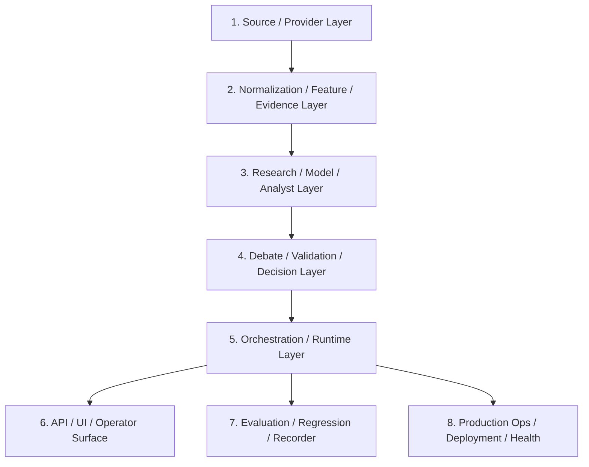

# 参考框架代码深读报告：结构、运行流与 FinBot 后续阶段方向

## 1. 本轮目标

本轮不是重新设计 FinBot 的研究边界，而是深读 `参考/` 下同类项目的本地代码，回答三个问题：

- 同类框架在拿到信源、行情、新闻或研究材料之后，如何组织下一步流程。
- 成熟项目的运行入口、状态机、插件/Provider、产物记录和复核机制是什么样的。
- FinBot 已完成的 P1-P4.1 应该如何接上 P5 及后续阶段。

阅读口径：

- 对核心参考项目读取入口、主循环、状态模型和关键产物契约。
- 对 SDK 型项目读取 adapter/provider 边界，不逐个交易所 connector 展开。
- 对交易执行型项目只借鉴工程结构，不继承交易下单、仓位、止损、目标价等能力。

## 2. 当前 FinBot 基线

FinBot 当前已经形成如下链路：

```text
Source Layer
  -> raw_evidence / normalized_documents
  -> event_candidates
  -> Phase 2 quality / macro / market / AI compression context
  -> Phase 3 ResearchCard
  -> Phase 3.5 follow-up dispatch + runner hardening
  -> Phase 4 ResearchBrief / WatchItem
  -> Phase 4.1 deterministic ResearchReviewCouncil
```

关键边界：

- 不生成交易建议。
- 不连接交易权限 API。
- AI compression 只做上下文压缩，不替代证据链。
- Firecrawl 必须走代理池，不允许 direct fallback。
- 旧新闻默认降级为背景或过时引用，不能轻易影响当前研究结论。

当前运行态快照：

- `sources`: 33
- `raw_evidence`: 134
- `normalized_documents`: 64
- `event_candidates`: 39
- `research_cards`: 5
- `research_watch_items`: 5
- `research_review_verdicts`: 30
- `research_councils`: 1
- 阻塞项主要是缺少 `ALPHA_VANTAGE_API_KEY`、`OPENBB_PAT`、`BEA_API_KEY`、`FRED_API_KEY`，以及 `news_reuters_search` provider 500。

## 3. 参考项目结构与运行流

### 3.1 TradingAgents：图状态 + 多角色分析/辩论/仲裁

核心路径：

- `参考/TradingAgents/tradingagents/graph/setup.py`
- `参考/TradingAgents/tradingagents/graph/conditional_logic.py`
- `参考/TradingAgents/tradingagents/graph/trading_graph.py`
- `参考/TradingAgents/tradingagents/agents/utils/agent_states.py`

项目结构：

- `agents/`：analyst、researcher、risk、trader 等角色节点。
- `graph/`：LangGraph workflow、conditional edges、propagation。
- `dataflows/` / tool layer：market、news、fundamentals、macro 等工具。
- `results/` / memory/checkpoint：运行结果、记忆、SQLite checkpoint。

运行流：

```text
START
  -> selected analysts: market / social / news / fundamentals
  -> 每个 analyst 可调用 tool node，多轮后 clear message
  -> Bull Researcher / Bear Researcher 交替辩论
  -> Research Manager 汇总
  -> Trader
  -> Aggressive / Conservative / Neutral risk analysts 轮转
  -> Portfolio Manager
  -> END
```

重要代码事实：

- `StateGraph(AgentState)` 作为核心编排器。
- analyst 节点通过 conditional edge 判断是否继续调用工具。
- debate 由 `investment_debate_state.count >= 2 * max_debate_rounds` 截止。
- risk discussion 由 `risk_debate_state.count >= 3 * max_risk_discuss_rounds` 截止。
- `TradingAgentsGraph.propagate()` 支持 per-ticker SQLite checkpoint，失败后可以从同一 ticker/date/graph signature 恢复。
- `AgentState` 显式持有 `market_report`、`sentiment_report`、`news_report`、`fundamentals_report`、`investment_debate_state`、`risk_debate_state`、`final_trade_decision`、`past_context`。

对 FinBot 的启发：

- P4.1 的多角色复核方向是正确的，但我们不应继承 `Trader` / `Portfolio Manager` 的交易决策终点。
- 可以借鉴 `AgentState` / checkpoint / memory log / graph signature，做 FinBot 的 research workflow state。
- 如果未来引入 LLM reviewer，应仍输出 research workflow verdict，而不是 trade decision。

### 3.2 Freqtrade：可靠运行循环 + 状态机 + 策略生命周期

核心路径：

- `参考/freqtrade/freqtrade/worker.py`
- `参考/freqtrade/freqtrade/freqtradebot.py`
- `参考/freqtrade/freqtrade/strategy/interface.py`
- `参考/freqtrade/docs/bot-basics.md`

项目结构：

- `commands/`：CLI 命令入口。
- `configuration/`：配置和校验。
- `exchange/`：交易所 adapter。
- `data/`：行情数据与 DataProvider。
- `strategy/`：策略接口与生命周期 callback。
- `persistence/`：交易、订单、状态持久化。
- `rpc/`：Telegram/Web/API 控制面。
- `freqai/`、`optimize/`：机器学习、回测、调参。

运行流：

```text
freqtrade trade
  -> Worker.run() 无限循环
  -> Worker._worker() 根据 State.RUNNING / PAUSED / STOPPED 分派
  -> _throttle() 控制每轮间隔，并对齐 candle 时间
  -> FreqtradeBot.process()
      -> reload markets
      -> get open trades from persistence
      -> refresh whitelist / pairlist
      -> refresh candles
      -> strategy.bot_loop_start()
      -> strategy.analyze()
      -> manage_open_orders()
      -> exit_positions()
      -> process_open_trade_positions()
      -> enter_positions()
      -> schedule / commit / rpc queue
```

重要代码事实：

- `Worker.run()` 是永久循环，`_worker()` 负责状态转换、heartbeat、watchdog、异常处理。
- `_throttle()` 保证每次 process 至少间隔配置秒数，并可对齐下一根 candle。
- `FreqtradeBot.process()` 只做编排，策略具体逻辑挂在 callbacks 上。
- `TemporaryError` 走短重试，`OperationalException` 进入停止态。

对 FinBot 的启发：

- P5 应该优先做 `ResearchWorkflowRunner` / `PipelineRunEngine`，而不是继续增加离散 CLI。
- 需要 run state、heartbeat、retry/backoff、budget gate、step commit、可恢复失败。
- 可以借鉴生命周期 callback，但 FinBot 的 callback 应是 `build_cards`、`validate_cards`、`promote_cards`、`dispatch_followups`、`run_followups`、`build_brief`、`build_council`。

### 3.3 Qlib：实验 Recorder + 依赖产物 + 可复现分析

核心路径：

- `参考/qlib/examples/workflow_by_code.py`
- `参考/qlib/qlib/workflow/record_temp.py`
- `参考/qlib/qlib/workflow/online/manager.py`

项目结构：

- `data/`：数据集与 handler。
- `model/`：模型层。
- `workflow/`：experiment、recorder、record template、online manager。
- `backtest/`：模拟执行与回测。
- `strategy/`：策略。
- `contrib/`：模型、策略、报告等扩展。

运行流：

```text
qlib.init()
  -> init model / dataset
  -> with R.start(experiment_name)
      -> R.log_params()
      -> model.fit(dataset)
      -> R.save_objects(params.pkl)
      -> SignalRecord.generate(): pred.pkl / label.pkl
      -> SigAnaRecord.generate(): IC / Rank IC
      -> PortAnaRecord.generate(): backtest report / positions / indicators / risk analysis
```

重要代码事实：

- `RecordTemp` 是产物模板基类，统一 `generate()`、`save()`、`load()`、artifact path。
- `ACRecordTemp` 可自动检查依赖产物，避免缺少上游结果时静默生成错误结果。
- `SignalRecord` 保存 `pred.pkl` 和 label。
- `SigAnaRecord` 依赖 `SignalRecord`，计算 IC/ICIR。
- `PortAnaRecord` 依赖 `SignalRecord`，生成组合分析和风险分析。

对 FinBot 的启发：

- P5/P7 需要类似 `ResearchRunRecorder`：每次运行记录输入快照、step 输出、质量指标、异常和最终 artifact。
- P7 不一定是交易回测，可以是 research regression：同一批 fixture evidence 生成的 card/brief/council 是否稳定，policy gate 是否仍通过。

### 3.4 OpenBB：Provider extension + 标准 Fetcher + REST/MCP 暴露

核心路径：

- `参考/OpenBB/openbb_platform/README.md`
- `参考/OpenBB/openbb_platform/core/openbb_core/provider/abstract/fetcher.py`
- `参考/OpenBB/openbb_platform/core/openbb_core/provider/registry.py`
- `参考/OpenBB/openbb_platform/providers/*/openbb_*`

项目结构：

- `core/openbb_core/provider/abstract/`：`Provider`、`Fetcher`、`QueryParams`、`Data`。
- `providers/`：Alpha Vantage、Benzinga、BLS、FRED、SEC、YFinance 等扩展。
- `core/openbb_core/api/`：REST API surface。
- 额外支持 Python、REST、MCP、Workspace/Excel 等消费面。

运行流：

```text
ExtensionLoader
  -> RegistryLoader.from_extensions()
  -> Provider registry
  -> route/query executor
  -> Fetcher.fetch_data(params, credentials)
      -> transform_query()
      -> extract_data() / aextract_data()
      -> transform_data()
  -> standardized Data / AnnotatedResult
  -> REST / Python / MCP consumers
```

重要代码事实：

- `Fetcher` 强制子类实现 `extract_data` 或 `aextract_data`。
- `fetch_data()` 固定三段式：`transform_query -> extract_data -> transform_data`。
- `RegistryLoader.from_extensions()` 从 entry points 加载 providers，并把 provider 放入 registry。
- README 明确 platform 自带 FastAPI REST API。

对 FinBot 的启发：

- FinBot source adapter 的方向和 OpenBB 一致，但我们需要把 `source_health`、`source_budget_state`、proxy policy、credential blockers 作为一等契约。
- P6 可以考虑只读 API/MCP surface，暴露 cards、briefs、councils、source health、follow-up queue，而不是暴露交易能力。

### 3.5 Hummingbot：事件驱动策略运行时 + connector/executor

核心路径：

- `参考/hummingbot/hummingbot/strategy/strategy_v2_base.py`
- `参考/hummingbot/scripts/simple_pmm.py`
- `参考/hummingbot/scripts/backtest_*.py`

项目结构：

- `connector/`：交易所和链上 connector。
- `strategy/`：策略基类和 V2 controller/executor。
- `controllers/`、`scripts/`：策略脚本和控制器。
- `client/`：CLI/UI/control plane。
- `conf/`：运行配置。

运行流：

```text
clock tick
  -> StrategyV2Base.tick()
      -> 等待 connectors ready
      -> 初始化 executor positions
      -> on_tick()
          -> controller/executor orchestration
          -> 或 simple script 自定义逻辑
```

`simple_pmm.py` 的示例流：

```text
on_tick()
  -> cancel_all_orders()
  -> create_proposal()
  -> budget_checker.adjust_candidates()
  -> place_orders()
  -> buy() / sell()
```

对 FinBot 的启发：

- 可借鉴 tick、connector readiness、budget checker、status formatting。
- 不应继承 order candidate / buy / sell 执行链。
- 对我们更有价值的是 “every tick produces actions, actions pass through budget/readiness gates”。

### 3.6 OctoBot：插件化产品外壳 + tentacles + tasks/services

核心路径：

- `参考/OctoBot/start.py`
- `参考/OctoBot/octobot/cli.py`
- `参考/OctoBot/octobot/octobot.py`
- `参考/OctoBot/octobot/initializer.py`
- `参考/OctoBot/octobot/task_manager.py`
- `参考/OctoBot/octobot/backtesting/octobot_backtesting.py`

项目结构：

- `octobot/`：产品主入口、CLI、initializer、task manager、backtesting factory。
- `packages/agents`、`packages/evaluators`、`packages/services`、`packages/trading`：子系统包。
- `packages/tentacles` / `tentacles_manager`：插件/策略/服务扩展体系。
- `docs/`、`docker/`、`tests/`：产品化配套。

运行流：

```text
start.py
  -> octobot.cli.main()
  -> start_octobot()
      -> load config
      -> load/install/repair tentacles
      -> config health check
      -> create OctoBot / OctoBotBacktestingFactory
      -> commands.start_bot()
  -> OctoBot.initialize()
      -> Initializer.create()
      -> TaskManager.start_tools_tasks()
      -> create_producers()
      -> start_producers()
      -> watchers / storage / services
```

重要代码事实：

- `TaskManager` 创建独立 asyncio loop，负责 start/stop tasks、thread join、timeout stop。
- `Initializer.create()` 先加载 tentacles setup config，再初始化 bot storage 和 channel。
- CLI 在创建 bot 前执行 config health check、tentacles repair、limits。
- backtesting 是独立 factory/path，不和 live path 混在一起。

对 FinBot 的启发：

- P8 可以借鉴它的 product shell：config profile、health check、task manager、state dump、service lifecycle。
- P5 先不做插件市场，但要把 run engine 设计成将来可插入 source/reviewer/exporter。

### 3.7 FinGPT：金融 LLM / RAG / 多 Agent 研究实验集合

核心路径：

- `参考/FinGPT/README.md`
- `参考/FinGPT/fingpt/FinGPT_RAG/README.md`
- `参考/FinGPT/fingpt/FinGPT_MultiAgentsRAG/README.md`
- `参考/FinGPT/fingpt/FinGPT_Forecaster/*`

项目结构：

- `FinGPT_RAG`：multi-source retrieval + instruction FinGPT。
- `FinGPT_MultiAgentsRAG`：RAG + MAS debate。
- `FinGPT_Forecaster`：公司新闻、财务、行情输入到 forecaster。
- `FinGPT_Benchmark`：任务评测和 instruction tuning。

运行流：

```text
financial data / news / filings
  -> retrieval / multisource context
  -> instruction-tuned or external LLM
  -> sentiment / forecast / report analysis
  -> benchmark/evaluation
```

对 FinBot 的启发：

- 我们已有 AI compression，但目前不应该一步到位引入重型 RAG。
- FinGPT 支持“RAG 可提升上下文质量”的方向，但它也暴露了一个风险：容易把 sentiment/forecast 当成直接交易前置信号。
- 更适合放在 P7/P9：当 ResearchCard、Council、Regression 足够稳定后，再引入可控的 RAG/reviewer。

### 3.8 FinRL：数据 -> 特征 -> 训练 -> 回测

核心路径：

- `参考/FinRL/README.md`
- `参考/FinRL/examples/FinRL_StockTrading_2026_1_data.py`
- `参考/FinRL/examples/FinRL_StockTrading_2026_2_train.py`
- `参考/FinRL/examples/FinRL_StockTrading_2026_3_Backtest.py`

项目结构：

- `finrl/meta`：data processors、preprocessors、market env。
- `finrl/agents`：Stable Baselines / RLlib / ElegantRL agents。
- `examples/`：数据、训练、回测 pipeline。

运行流：

```text
Yahoo / market data
  -> FeatureEngineer: MACD / RSI / VIX / turbulence
  -> data_split: train / trade
  -> StockTradingEnv
  -> DRLAgent training
  -> DRL_prediction
  -> baseline comparison / backtest plot
```

对 FinBot 的启发：

- 它是预测/交易训练框架，近期不适合纳入主线。
- 有价值的是 train/test/backtest 切分思想，可转译成 FinBot 的 research fixture / regression test / historical replay。

### 3.9 CCXT / gateapi-python / pybit：交易所 SDK substrate

核心判断：

- `ccxt` 是多交易所统一 API。
- `gateapi-python`、`pybit` 是特定交易所 SDK。
- 它们适合作为只读 market adapter 的底层依赖，不适合作为 FinBot 当前主线。

对 FinBot 的启发：

- 如果后续扩展行情源，优先只接 public/read-only endpoint。
- 不引入 private account/order 权限。

### 3.10 简单新闻情绪项目：反例

核心项目：

- `参考/Binance-News-Sentiment-Bot`
- `参考/cryptocurrency-news-analysis`

共同模式：

```text
news headline/body
  -> sentiment score
  -> threshold
  -> buy/sell or signal
```

对 FinBot 的启发：

- 这是我们应避免的路径。
- 新闻情绪不能直接升级为交易动作。
- FinBot 当前的 evidence freshness、validation、follow-up、council 边界是必要的。

## 4. 同类框架的共同架构收敛

本地参考项目可以抽象成 8 层：



映射关系：

| 层 | 外部参考 | FinBot 当前状态 |
| --- | --- | --- |
| Source / Provider | OpenBB、CCXT、SDKs | 已有 source catalog、adapter、source_health |
| Normalization / Evidence | FinRL preprocess、Qlib dataset、OpenBB transform | 已有 normalized_documents、event_candidates、quality |
| Research / Analyst | TradingAgents analysts、FinGPT RAG | 已有 ResearchCard、AI compression context |
| Debate / Validation | TradingAgents debate、FinGPT MAS、Qlib analysis | 已有 P4.1 deterministic council |
| Orchestration / Runtime | Freqtrade Worker、Qlib workflow、OctoBot TaskManager | 缺口最大 |
| API / UI | OpenBB REST/MCP、Freqtrade WebUI/RPC、OctoBot Web | 未开始 |
| Evaluation / Recorder | Qlib Recorder、Freqtrade backtest、FinRL backtest | 未系统化 |
| Production Ops | Docker、health、watchdog、state dump | 部分 source health，缺完整服务化 |

## 5. 对 FinBot 的关键判断

### 5.1 我们不是交易 Bot

参考项目里很多最终都会走到：

```text
signal -> portfolio/risk -> order execution
```

FinBot 的目标应保持为：

```text
source -> evidence -> research card -> validation -> council -> follow-up / operator action
```

这意味着：

- `OperatorAction` 是研究工作流动作，不是交易动作。
- `CouncilVerdict` 是审计/复核产物，不是投资结论。
- `AICompression` 和未来 LLM reviewer 都不能成为事实源。

### 5.2 P5 不应该继续堆 analyst，而应该补 Runtime

当前 FinBot 的功能散落在多个 CLI：

- `run_once`
- `process_evidence`
- `build_research_cards`
- `validate_research_cards`
- `promote_research_cards`
- `dispatch_research_followups`
- `run_research_followups`
- `build_phase4_brief`
- `build_phase41_council`
- `status`

这些 CLI 已经能跑通功能，但缺少成熟框架都有的东西：

- 一次 pipeline run 的统一 ID。
- 每个 step 的输入、输出、状态、耗时、异常、重试记录。
- 失败后从失败 step 恢复。
- 预算和 provider health 在 step 前统一 gate。
- 运行完成后生成 recorder/report。
- schedule/loop 统一管理。

因此 P5 应该是：

```text
Phase 5: Research Workflow Orchestrator / Run Engine
```

### 5.3 RAG 暂时仍不应提前进入主链路

对照 FinGPT 和 TradingAgents，RAG/LLM agent 的价值确实存在，但现在直接引入会放大三个问题：

- 证据链和研究卡契约还没经过足够回归测试。
- 当前数据规模还不需要向量库才能检索。
- 金融新闻强时效，旧消息被召回后容易污染当前判断。

更合理的顺序是：

```text
P5 Orchestrator
  -> P6 API / Workbench
  -> P7 Recorder / Regression / Evaluation
  -> Optional P9 RAG / LLM reviewer
```

## 6. 建议的后续 Phase

### Phase 5：Research Workflow Orchestrator

目标：

- 把 P1-P4.1 串成可重复、可追踪、可恢复的 run engine。

建议新增模型：

```text
research_pipeline_runs
research_pipeline_steps
research_pipeline_artifacts
```

建议 step：

```text
source_smoke_optional
ingestion_run
evidence_process
phase2_context
ai_compression_optional
build_research_cards
validate_research_cards
promote_research_cards
dispatch_followups
run_followups_optional
rebuild_after_followups_optional
build_phase4_brief
build_phase41_council
status_snapshot
run_report
```

关键规则：

- 每个 step 必须 idempotent 或显式声明 destructive/clear-existing。
- 每个 step 开始前检查 source budget/provider blocker。
- Follow-up runner 继续保留 Firecrawl proxy pool 强制规则。
- 失败 step 写入 `failed`，记录 exception summary 和 retry eligibility。
- `needs-followup` 可自动触发小批量 follow-up，然后 rebuild P3/P4/P4.1。

### Phase 6：Research API / Operator Workbench

目标：

- 给人或上层 agent 一个只读、可操作的研究运营界面。

建议 API/视图：

- source health / credential blockers。
- latest research cards。
- watch items。
- latest brief。
- latest council。
- follow-up queue。
- pipeline run history。

边界：

- 不暴露交易 API。
- 不输出价格目标、仓位、买卖动作。
- 所有 action 都是 research workflow action。

### Phase 7：Evaluation / Regression / Recorder

目标：

- 建立类似 Qlib Recorder 的研究产物回归体系。

建议能力：

- 固定 fixture evidence replay。
- ResearchCard schema regression。
- policy gate regression。
- freshness gate regression。
- council consensus regression。
- source blocker regression。
- AI compression boundary regression。

### Phase 8：Production Runtime / Ops

目标：

- 把 FinBot 从脚本集合升级为可长期运行的研究服务。

建议能力：

- scheduler daemon。
- health endpoint。
- state dump。
- structured logs。
- run watchdog。
- Docker/systemd/Windows task runner 运行方式。
- config profile。
- secret redaction。

### Optional Phase 9：Controlled RAG / LLM Reviewer

前置条件：

- P5 run engine 稳定。
- P7 regression 能防止越界结论和旧新闻污染。
- ResearchCard/Council artifact 足够多，可以做检索边界。

建议边界：

- RAG 只检索 FinBot 自己验证过的 cards/briefs/councils。
- 默认不召回过期新闻作为 primary evidence。
- LLM reviewer 输出 `review_note` / `question` / `missing_context`，不输出 trade action。

## 7. 推荐下一步

下一步直接推进 P5：

```text
docs/12-phase5-research-workflow-orchestrator.md
  -> 数据模型设计
  -> step contract
  -> runner implementation
  -> CLI: python -m finbot.cli.run_research_pipeline
  -> status/report 集成
  -> smoke 验证
```

最小闭环验收：

```powershell
python -m compileall finbot
python -m finbot.cli.run_research_pipeline --dry-run
python -m finbot.cli.run_research_pipeline --max-events 10 --followups-dry-run
python -m finbot.cli.status
```

P5 做完后，FinBot 的形态会从“多个已实现阶段”升级为“一个可运营的研究流水线”。这比现在直接引入 RAG 或更多 Agent 更关键。
