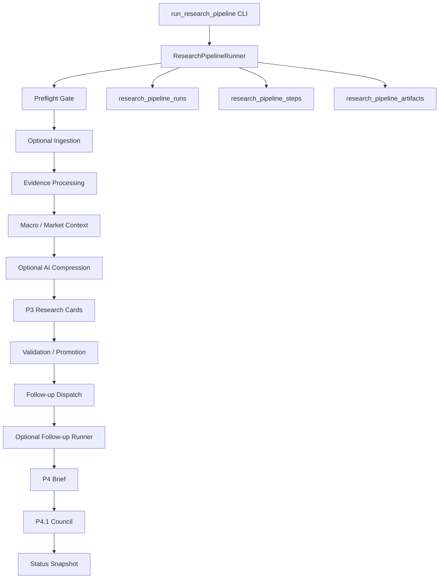

# Phase 5 设计：Research Workflow Orchestrator

## 1. 阶段定位

P5 接在 P4.1 后面，不新增交易能力，也不重新定义研究结论。

一句话：

```text
P1-P4.1 已经能产出研究卡片、运营简报和 council verdict。
P5 负责把这些阶段串成一次可追踪、可恢复、可复跑的研究流水线。
```

## 2. 边界

P5 做：

- 统一编排 ingestion、evidence processing、P2 context、P3、P4、P4.1。
- 为每次 pipeline run 记录 run id、配置、step 状态、耗时、错误、输出摘要和 artifact。
- 支持 `--dry-run` 预览执行计划。
- 支持保守默认：不默认触发外部网络成本、不默认跑 AI compression、不默认真实执行 follow-up。
- 在 follow-up 执行前继续尊重 source budget、provider blocker 和 Firecrawl proxy pool 强制规则。

P5 不做：

- 不生成买卖、仓位、目标价、止损止盈。
- 不连接交易权限 API。
- 不把 AI compression 或 reviewer 输出当事实源。
- 不把旧新闻重新升级为当前主证据。

## 3. 总体架构



## 4. Step Contract

每个 step 必须输出统一结构：

```json
{
  "step_name": "build_research_cards",
  "status": "passed",
  "started_at": "...",
  "finished_at": "...",
  "duration_ms": 123,
  "input": {},
  "output": {},
  "error": null
}
```

状态：

| 状态 | 含义 |
| --- | --- |
| `planned` | dry-run 或待执行 |
| `running` | 正在执行 |
| `passed` | 执行成功 |
| `skipped` | 配置禁用或前置条件不满足 |
| `reused` | resume/from-step 复用前序 step 的最新非失败 attempt |
| `failed` | 执行异常 |

## 5. 默认 Step 顺序

默认执行：

```text
preflight
process_evidence
macro_facts
market_confirmation
build_research_cards
validate_research_cards
promote_research_cards
dispatch_followups
build_phase4_brief
build_phase41_council
status_snapshot
```

显式开启：

```text
ingestion_run        --run-ingestion
ai_compression       --run-ai-compression
run_followups        --run-followups 或 --followups-dry-run
```

## 6. 数据模型

```sql
create table if not exists research_pipeline_runs (
  run_id text primary key,
  profile text not null,
  status text not null,
  triggered_by text,
  config_json text not null,
  summary_json text not null,
  started_at text not null,
  finished_at text,
  error text
);
```

```sql
create table if not exists research_pipeline_steps (
  step_id text primary key,
  run_id text not null,
  step_name text not null,
  status text not null,
  attempt integer not null,
  started_at text,
  finished_at text,
  duration_ms integer,
  input_json text not null,
  output_json text not null,
  error text,
  created_at text not null,
  updated_at text not null
);
```

```sql
create table if not exists research_pipeline_artifacts (
  artifact_id text primary key,
  run_id text not null,
  step_name text,
  artifact_type text not null,
  path text,
  ref_id text,
  payload_json text not null,
  created_at text not null
);
```

## 7. P5 运行策略

默认安全策略：

- 不跑全量 ingestion。
- 不实际调用 AI provider。
- 不真实执行 follow-up 网络请求。
- 不清理 P3/P4/P4.1 旧产物，除非传入 `--clear-existing`。

可控扩展：

- `--run-ingestion`：执行一次 source scheduler pass。
- `--run-ai-compression`：调用 DeepSeek/Mimo OpenAI-compatible provider。
- `--followups-dry-run`：只预览 research follow-up 队列。
- `--run-followups`：真实执行小批量 research follow-up。
- `--clear-existing`：清理当前阶段派生产物后重建。
- `--continue-on-error`：记录失败但继续后续 step，默认失败即停止。

## 8. P5.1-P5.4 加固设计

### P5.1 Resume / From-step / Idempotency

新增运行参数：

```powershell
python -m finbot.cli.run_research_pipeline --resume-run-id <run_id> --from-step build_phase4_brief
python -m finbot.cli.run_research_pipeline --from-step validate_research_cards
```

规则：

- `--resume-run-id` 复用已有 `run_id`，不创建新 pipeline run。
- 同一个 run 内重复执行同名 step 时，`attempt` 自动递增。
- `--from-step` 之前的 step 会记录为 `reused`，并引用上一条非失败 attempt。
- 如果要复用的前序 step 最新状态是 `failed`，必须从该失败 step 或更早 step 恢复，不能跳过失败。
- 默认开启 run-scoped idempotency：同一 `pipeline_run_id` 的 P3/P4/P4.1 派生产物会在重建前清理，避免 resume 重跑污染。
- 可用 `--no-idempotent-outputs` 关闭主动清理，但仍保留 `pipeline_run_id` 归因。

### P5.2 Pipeline Run Lineage

以下表新增 nullable `pipeline_run_id`，旧数据兼容：

```text
ai_compressions
research_cards
research_card_validations
research_card_decisions
research_followup_dispatches
research_watch_items
research_briefs
research_review_verdicts
research_councils
```

读写策略：

- 正常全量 pipeline：下游优先读取同一 `pipeline_run_id` 的上游产物。
- resume pipeline：继续使用同一 `pipeline_run_id`，形成完整 attempt 链。
- 手动 `--from-step` 新开局部 run：如果当前 run 没有上游血缘产物，则回退读取全局最新上游产物，同时把新产物归因到当前 run。

### P5.3 Test Coverage

新增标准库测试：

```powershell
python -m unittest discover -s tests
```

覆盖：

- dry-run 不写 `research_pipeline_runs`。
- 默认不启用 ingestion、AI compression 和真实 follow-up。
- failed step 可通过 `--resume-run-id --from-step` 恢复，前序 step 记录为 `reused`。
- `pipeline_run_id` 过滤和 artifact retention 行为。

### P5.4 Operations / Retention / Status

新增 artifact retention 参数：

```powershell
python -m finbot.cli.run_research_pipeline --artifact-retention-keep-runs 10
python -m finbot.cli.run_research_pipeline --artifact-retention-days 14
```

`status` 输出增强：

- `latest_pipeline_run.readable_summary`
- 每个 step 的最新 `attempt`
- 当前 run 的 `artifact_counts`

SQLite 连接管理已改为真正的 context manager：正常 commit、异常 rollback、最终 close，避免 Windows 下 SQLite 文件句柄泄露。

## 9. 验收命令

```powershell
python -m compileall finbot
python -m unittest discover -s tests
python -m finbot.cli.run_research_pipeline --dry-run
python -m finbot.cli.run_research_pipeline --max-events 10 --followups-dry-run
python -m finbot.cli.run_research_pipeline --resume-run-id <run_id> --from-step build_phase4_brief --followups-dry-run
python -m finbot.cli.status
```

## 10. 当前实现状态

已实现：

- `ResearchPipelineRunner`
- `--resume-run-id`
- `--from-step`
- run-scoped `attempt`
- run-scoped `pipeline_run_id` lineage
- run-scoped idempotency
- artifact retention
- `run_research_pipeline` CLI
- `research_pipeline_runs` 表
- `research_pipeline_steps` 表
- `research_pipeline_artifacts` 表
- `status` 统计 pipeline 表和 latest run
- pipeline latest report：`data/reports/research-pipeline-latest.json`
- 标准库测试：`tests/test_research_pipeline.py`

当前已验证：

```powershell
python -m compileall finbot
python -m unittest discover -s tests
python -m finbot.cli.run_research_pipeline --dry-run
python -m finbot.cli.run_research_pipeline --max-events 3 --phase4-limit-items 5 --phase41-limit-items 5 --followups-dry-run --artifact-retention-keep-runs 10
python -m finbot.cli.run_research_pipeline --resume-run-id 85a5505458f91479f4444616ae8dde9c --from-step build_phase4_brief --phase4-limit-items 5 --phase41-limit-items 5 --followups-dry-run
python -m finbot.cli.status
```

当前边界：

- 默认跳过 `ingestion_run`，避免无意触发外部网络请求。
- 默认跳过 `ai_compression`，避免无意消耗 provider token。
- `--followups-dry-run` 只预览 follow-up 队列，不执行 Firecrawl 或市场 API。
- 真实 follow-up 仍复用 P3.5 `ResearchFollowupRunner`，Firecrawl 继续强制使用代理池。
