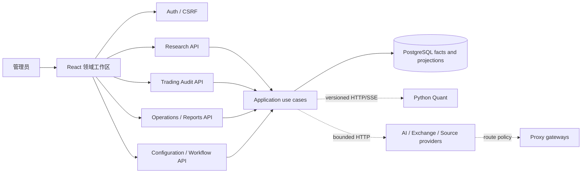

# ADR 014：以领域工作区恢复功能等价并采用 SPA CSRF 契约

状态：Accepted

日期：2026-07-15

## 背景

Java breaking migration 将运行时、数据库和 API 成功切换到 Java 26/PostgreSQL，但前端重建以“覆盖 8 个核心页面”为验收口径，导致旧版用户工作区、筛选详情和操作闭环被合并或遗漏。Spring Security 使用 cookie CSRF repository，却沿用默认 XOR request handler；React 又优先发送响应体 token，生产写请求因此稳定 403。

## 决策

### 页面边界

- Web 按研究决策、分析交易、任务记录和系统四个领域分组，恢复 13 个用户工作区。
- 页面组件只调用 `/api/v2`，不加载归档仓库代码，不引入 `/api/v1` adapter。
- 共用筛选、cursor、状态、详情抽屉、异步任务和 SSE hooks；领域页面不各自重写网络和错误模型。
- URL 保存主页面和子视图；全局状态只保存跨页面 session、readiness 和运行通知。

### 后端边界

- Controller 只负责 typed request/response、认证和校验；跨表时间线、报告和 readiness 使用专用 query service/projection。
- 本地决策/风控/OMS 与交易所事实保留独立 source/type，查询层统一排序，不把本地状态伪装成成交。
- 市场分析和量化预览仍由 Python 计算，Java 负责命令、状态、审计和类型转换。

### SPA CSRF

- 服务端使用组合 request handler：响应 attribute 继续 XOR，header 明确按 plain cookie token 解析，并强制生成 cookie。
- React 写请求优先读取 `XSRF-TOKEN` cookie；响应体 token 只在 cookie 尚未出现时作为兼容回退。
- 使用真实 cookie/header 的 MockMvc 测试和生产浏览器无副作用 PUT smoke 双重验收。

### 迁移门禁

- “页面存在”不等于“功能已迁移”。每个矩阵项必须同时具备数据/API、UI、状态/错误、测试和生产证据。
- 旧能力若由新能力替代，文档必须写清替代路径与行为差异；移除必须由用户明确确认。
- 按 P0/P1/P2 分批发布，允许生产短暂中断，但任何批次不得破坏已完成能力。

## 结果

- 工作区数量增加，但领域边界和用户动线比单个超长页面更清晰。
- 需要新增一组 query projection 和 `/api/v2` 端点；这是功能等价所需成本，不建设旧 API 兼容层。
- 账户时间线成为永久交易仓库的主要读取面，也承载预估交易但保持来源标识。
- CSRF 安全性保留，修复 SPA 兼容而不是关闭 CSRF。

## 回滚

- CSRF handler 可单独回滚到上一镜像，但生产写功能会重新不可用。
- 页面批次可按不可变镜像回滚；Liquibase 只追加表/列/索引，不依赖删除历史数据。
- 预估记录与统一审计查询均不写交易所，不影响 OMS 回滚。
