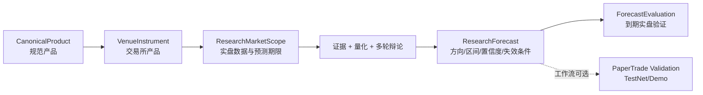

# ADR-015 研究预测主领域与验证边界

## 状态

Accepted，2026-07-15。

## 决策

FinBot 的主业务是基于实盘公开数据，对具体产品在明确预测期限内的走势形成可审计研究结论。模拟交易不是研究完成条件，只是可选验证适配器。

核心层级固定为：

- `CanonicalProduct` 表达跨交易所的产品身份；`VenueInstrument` 保存 Gate/Bybit 各自的 symbol、市场类型、精度、合约单位、最大杠杆和状态。
- 市场分析请求必须引用 `instrument_id`，不得只凭 symbol 猜测现货或永续合约。
- `ProductCatalogGateway`、`MarketDataGateway` 固定访问交易所生产公开市场接口；无需 API key，也不依赖模拟账户是否启用。
- `PaperExchangeGateway` 才访问 Gate TestNet / Bybit Demo 鉴权接口。账户开关只影响模拟验证。
- 单产品走势研究必须提供 K 线周期和预测期限。主席输出结构化 `ForecastSignal`；系统使用采集到的实盘参考价，不信任模型自行改写参考价。
- 到期评估重新拉取实盘 K 线，并记录方向命中、区间命中和实际涨跌幅。`UNCERTAIN` 是可计量的主动回避，不伪装成方向命中或失败。
- 只有工作流包含并启用 `EXECUTION_REVIEW` 节点时，研究流水线才进入模拟交易验证；其他工作流在 Forecast/主席结论完成后终止。
- 交易执行层从 `RiskAssessment` 开始绑定 `account_id + instrument_id + exchange`，并由数据库复合外键阻止跨交易所串单。

## 取舍

- 研究与模拟交易解耦后，即使没有交易所私有 key 或模拟账户不可用，实盘公开数据研究仍可运行。
- 预测准确率需要等待目标时间到期，不能用模拟盘盈亏替代；模拟盘流动性、撮合和产品可用性只作为执行验证证据。
- 当前结构化 Forecast 针对显式选择单个 instrument 的走势预测。默认自选列表的多产品研究仍保留主席综合结论，后续应按产品拆分为独立 scope/run，而不是在一个 Forecast 中混放多个产品。

## 回滚点

- 应用层可停用 `schedule_forecast_evaluation`，不会影响已有研究与历史数据。
- 不回退 `research_market_scope`、`research_forecast` 或交易执行隔离字段；回退应用时保留表结构与数据，只停止新写入。
