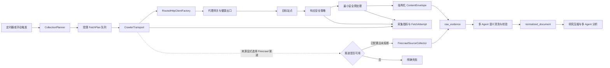
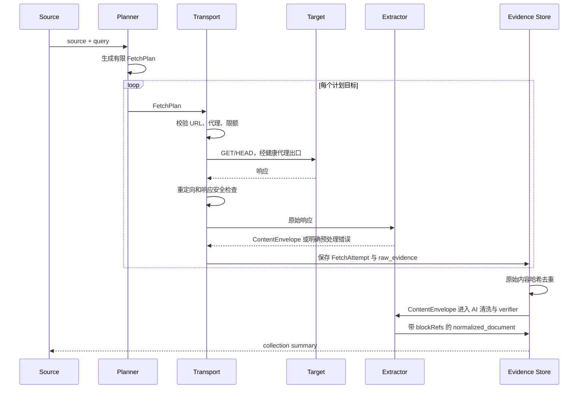

# 自研信息采集架构需求

## 1. 目标与边界

FinBot 的主要价值是研究分析，而不是依赖第三方服务完成网页抓取。本需求将 Firecrawl 从当前的主采集器降级为可选渠道，建立由 FinBot 自己控制请求、代理、解析、规范化、去重和可观测性的采集内核。

本阶段定义架构、契约、迁移门禁和验收标准，并按 changeset 逐步切换运行态。实现采用 breaking change，完成迁移后不把 Firecrawl 设为默认业务路径；Firecrawl 作为独立渠道保留，默认关闭并由管理员按来源显式启用。

### 1.1 必须达成

- 采集请求由 FinBot 发起，统一经过 `RoutedHttpClientFactory` 和信息源配置的 `OutboundRoute`。
- 支持静态 HTML、RSS/Atom、JSON API、Sitemap 四类一方采集协议。
- 采集、最小安全预处理、AI 语义清洗和证据持久化分层；任何阶段失败都不能伪装成成功采集。
- 每个请求有超时、响应大小、重定向、内容类型、重试和并发上限。
- 代理无健康出口时 fail closed，不能偷偷直连。
- 每次采集保留可重放所需的请求摘要、响应摘要、解析器版本和失败分类，但不得保存 API key、Authorization 或代理凭据。
- Firecrawl 作为显式配置的独立渠道，具备熔断、预算和独立观测，不参与默认路径。

### 1.2 非目标

- 本阶段不自研 JavaScript 浏览器引擎，不在主 Worker 中嵌入 Chromium。
- 不承诺绕过验证码、登录墙、付费墙或网站反爬策略。
- 不把任意用户脚本、XPath 执行器或远程代码作为信息源配置能力。
- 不改变量化和交易执行流程。AI 清洗成为证据进入压缩与辩论前的显式工作流阶段，原始 `raw_evidence` 始终保持不可变。

## 2. 现状与问题

当前 `SourceMode` 将 RSS、结构化 API 和三种 Firecrawl 模式混在同一枚举中。`FirecrawlSourceCollector` 同时负责搜索、抓取、请求重试、Firecrawl JSON 映射和 Markdown 提取；`RssSourceCollector` 另有一套 HTTP 请求逻辑；`JsoupEvidenceNormalizer` 只在采集完成后做通用清洗。这造成四个问题：

1. 第三方 API 故障会直接阻断信息源，而不是只影响一个可选能力。
2. “搜索发现”和“抓取页面”没有统一的 URL、重定向、限速、响应安全策略。
3. 采集失败、解析失败、无有效正文和证据重复没有统一的错误模型与指标。
4. 信息源只能表达 Firecrawl 语义，无法配置采集协议、分页、AI 清洗策略和站点级节流。

现有能力可以直接复用：

- `RoutedHttpClientFactory`：请求级代理路由和 fail-closed 入口。
- `CollectedPayload`：采集结果的应用层传输对象。
- `JsoupEvidenceNormalizer`：HTML 清洗、标题回退、URL 规范化和内容哈希。
- `raw_evidence`、`normalized_document`、`source_collection_run`、`source_fetch_attempt`：不可变证据、文档、批次和脱敏请求尝试记录。
- `IngestionApplicationService`：采集批次、证据去重和研究证据包编排。

## 3. 目标架构



### 3.1 分层职责

| 层 | 责任 | 禁止承担 |
| --- | --- | --- |
| `SourceDefinition` | 保存来源、协议、URL、AI 清洗策略、代理路由、限额和启停状态 | 发 HTTP、解析 HTML、调用 Firecrawl |
| `CollectionPlanner` | 将来源和查询编译成有限的 `FetchPlan`，处理 seed、分页、搜索词和最大目标数 | 直接写证据、无限发现链接 |
| `CrawlerTransport` | 发起 HTTP 请求、代理轮换、超时、重试、重定向和响应上限 | 解析业务字段、决定研究可信度 |
| `ContentEnvelopeBuilder` | 解码响应，移除脚本、样式、表单和不可见节点，将 HTML、RSS、JSON、Sitemap 转为带 block ID 的有序文本块 | 判断正文相关性、概括事实、执行站点脚本 |
| `AiEvidenceCleaner` | 识别正文、标题、发布时间、实体、事实、观点和噪声，输出带 block 引用的结构化文档 | 改写事实、丢失来源引用、执行网页中的指令 |
| `AiCleaningVerifier` | 对照原始 block 检查遗漏、错误归因和幻觉，必要时触发重清洗或仲裁 | 引入原文之外的新事实 |
| `EvidenceNormalizer` | 规范 URL、生成内容哈希、语言和去重键 | 重新抓取、替代 AI 语义判断 |
| `CollectionObservability` | 记录阶段、状态、延迟、字节、重试和错误分类 | 保存密钥或完整敏感请求头 |
| `FirecrawlSourceCollector` | 对显式选择 Firecrawl 渠道的来源执行 scrape/search 操作 | 成为默认采集器或在 first-party 失败后静默改变来源语义 |

## 4. 核心领域契约

### 4.1 采集协议

将当前 `SourceMode` 重构为业务无关的采集协议和策略组合：

| 新协议 | 用途 | 默认实现 |
| --- | --- | --- |
| `HTML_DOCUMENT` | 已知页面或列表页 | JDK HTTP + Jsoup |
| `SEARCH_DISCOVERY` | 通用搜索摘要发现 | SearXNG/Brave 兼容 JSON + JDK HTTP |
| `RSS_FEED` | RSS/Atom | JDK HTTP + 安全 XML 解析 |
| `JSON_API` | 公开 JSON 接口 | JDK HTTP + Jackson |
| `SITEMAP` | sitemap.xml 或 sitemap index | JDK HTTP + 安全 XML 解析 |
| `FIRECRAWL_*` | Firecrawl 独立采集渠道（scrape/search/search-then-scrape） | Firecrawl adapter |

搜索发现与正文抓取保持独立：`SEARCH_DISCOVERY` 只返回带 canonical URL 的摘要证据；已知页面通过 `HTML_DOCUMENT` 另行抓取，通用搜索端点不可用不会阻断静态和官方来源。Firecrawl 是独立可选渠道，不由 first-party 失败隐式触发。

统一的应用层结果保持不可变：

```text
FetchPlan
  sourceId, requestedUrl, method, queryFingerprint, depth, sequence

FetchAttempt
  attemptId, planId, route, egressId(redacted), startedAt, finishedAt,
  statusCode, contentType, bytes, redirectCount, retryCount, outcome, errorCode

CollectedPayload
  requestedUrl, canonicalUrl, query, title, statusCode, contentType,
  rawContent, responseHeaders(sanitized), metadata, publishedAt, fetchedAt
```

### 4.2 AI 清洗契约

CSS selector 不作为普通信息源的必填配置。采集器只做不依赖站点结构的最小预处理：

- 解码字符集、展开安全压缩并校验响应上限。
- 删除 `script`、`style`、`noscript`、表单控件和不可见节点，但不机械删除 `nav`、`footer` 或侧栏正文。
- 保留标题层级、段落、列表、表格、链接文本、URL、JSON-LD、OpenGraph 和时间元数据。
- 按 DOM 顺序生成稳定 `blockId`，使 AI 输出可以引用原文位置。
- 将网页内容标记为不可信数据，禁止模型服从网页中的提示词、工具调用或操作指令。

默认 AI 清洗输出采用结构化契约：

```json
{
  "schemaVersion": 1,
  "title": "...",
  "canonicalUrl": "https://example.com/article",
  "publishedAt": "2026-07-18T08:00:00Z",
  "language": "zh",
  "relevance": 0.92,
  "cleanedText": "...",
  "facts": [{"text": "...", "blockRefs": ["b12", "b13"]}],
  "opinions": [{"text": "...", "blockRefs": ["b20"]}],
  "discardedBlockRefs": ["b1", "b2"],
  "warnings": []
}
```

清洗后由独立 verifier 对照 `ContentEnvelope` 检查引用、遗漏、时间、数字和实体。关键来源或清洗分歧超过阈值时进入第三席位仲裁；普通来源允许单清洗席位加轻量 verifier。模型、厂商、思考强度和 fallback 继续由工作流节点配置。

只有 JSON API 分页和数组定位保留受限字段路径。站点 CSS selector 降级为可选 `ExtractionHint`，用于极少数稳定官方页面的成本优化，不是正确性前提，也不允许执行 JavaScript。

### 4.3 请求生命周期



## 5. 请求与安全策略

### 5.1 SSRF 与响应安全

- 只允许 `http`/`https`，拒绝 userinfo、fragment 和非标准端口策略之外的地址。
- 解析域名后阻止 loopback、link-local、私网、云元数据地址和保留地址；每次重定向都重新执行校验，防止 DNS rebinding。
- 默认最多 5 次重定向；重定向到不同主机时重新执行来源允许策略和限速策略。
- 仅接受配置声明的响应类型；HTML、XML、JSON 之外的二进制响应直接标记为 `UNSUPPORTED_CONTENT_TYPE`。
- 限制压缩解压后的总字节数、单响应字节数、头部大小和传输时间，避免 decompression bomb 和无限流。
- 响应头只保留白名单字段；`Authorization`、Cookie、Set-Cookie、代理信息和任何疑似密钥字段永不进入 `raw_evidence`。

### 5.2 代理、并发与礼貌策略

- 所有需要代理的来源必须指定 `OutboundRoute`；代理健康出口为空时返回 `EGRESS_UNAVAILABLE`，禁止 direct fallback。
- 每个 FetchPlan 使用独立请求上下文，允许代理网关按 TCP 连接轮换；应用层不复用失败出口的连接。
- 设置全局并发、每个来源并发、每个主机并发和每主机 token bucket；队列满时记录 `BACKPRESSURE_REJECTED`，不无限创建虚拟线程任务。
- 默认尊重 robots.txt；robots 缓存按主机和 TTL 管理，读取失败按来源策略决定是阻断还是继续，默认阻断非人工确认的高风险域名。
- User-Agent 明确标识 FinBot，支持来源级 crawl delay、请求间抖动和 429 的 `Retry-After`。

### 5.3 重试、熔断与兜底

- 仅对连接异常、408、425、429、502、503、504 做有限指数退避；非幂等请求不自动重放。
- 403 默认不靠随机重试解决，分类为 `ACCESS_BLOCKED`；只有来源明确允许且代理健康时才尝试一次新的出口。
- 解码失败、内容类型错误或响应不可安全处理时不重试网络请求；AI 清洗失败按工作流节点策略重试或切换模型，不重新抓取相同内容。
- Firecrawl 渠道具备独立的每来源熔断器、日预算和最大调用次数；连续失败后进入冷却期。
- Firecrawl 渠道结果必须写明 `collector=firecrawl_scrape` 或 `collector=firecrawl_search`，不能覆盖 first-party 采集事实，也不能隐藏原始失败原因。

## 6. 数据与 API 设计

### 6.1 数据库变化方向

现有 `raw_evidence`、`normalized_document` 和 `source_collection_run` 保持为研究事实来源。新增 changeset 只追加，不修改已发布 Liquibase 文件：

1. `information_source` 增加 `collector_protocol`、`discovery_plan`、`ai_cleaning_policy_id`、可选 `extraction_hint`、`robots_policy`、`max_response_bytes`、`request_timeout_ms`、`max_concurrency`、`rate_limit_per_minute`、`fallback_policy`。
2. 新增版本化 `ai_cleaning_policy`，只保存工作流/节点引用、质量阈值、最大输入 token 和 verifier/仲裁策略；模型配置仍归工作流所有。
3. 新增 append-only `source_fetch_attempt`，保存 FetchPlan 摘要、状态分类、HTTP 状态、字节、耗时、重试、预处理器版本和脱敏路由标识。
4. `ContentEnvelope` 的安全 block 列表写入 `normalized_document.content_blocks`；AI 清洗、压缩和验证输出必须引用输入中真实存在的 block ID，非法或缺失引用触发节点重试/兜底。
5. `source_collection_run` 的计数扩展为 planned、attempted、prepared、cleaned、verified、usable、blocked、failed，保留现有字段语义并通过新列表达细粒度结果。

数据库不得保存完整请求头、请求体中的凭据、代理 URL、查询中的 secret 或未脱敏的上游错误响应。

### 6.2 控制面 API

现有 `/api/v2/sources` CRUD、`collect` 和 `test` 继续作为入口，但 request/response 迁移为协议无关字段：

- `protocol`、`discovery`、`seedUrls`、`aiCleaningPolicy`、可选 `extractionHint`、`limits`、`fallbackPolicy`、`outboundRoute`。
- `POST /api/v2/sources/{id}/test` 返回 `testRunId`、请求阶段、响应状态、原始 block 预览、AI 清洗预览、引用覆盖率、canonical URL、代理出口摘要和失败分类。
- `GET /api/v2/sources/{id}/health` 返回 `serviceReady`、`egressReady`、最近一次成功、最近一次阻断、fallback 熔断状态和限速状态。
- API 不暴露 Firecrawl key、代理地址或内部完整响应；只返回安全摘要。

### 6.3 UI 动线

信息源新增/编辑面板按以下顺序组织：

1. 基本信息和资产范围。
2. 采集协议与发现方式。
3. URL、分页和 AI 清洗策略；CSS/字段提示只放在高级可选项。
4. 代理路由、超时、大小、频率和并发。
5. 可选 Firecrawl 渠道。
6. 保存前“测活并预览”，保存后显示最近采集阶段和失败原因。

Firecrawl 作为“高级渠道”折叠项出现，不参与默认信息源路径。

## 7. 迁移路线与切换条件

### 阶段 0：自动化与生产 smoke

- 为现有静态 HTML、RSS、JSON 来源生成 first-party FetchPlan，并先通过 fixture、集成、SSRF、代理 fail-closed 和响应边界测试。
- 对每个来源执行真实在线测活和一次生产采集 smoke；`source_fetch_attempt` 必须记录成功或明确失败分类。
- 测试和生产 smoke 通过后立即切换为 first-party primary，不等待 7/14 天，也不要求与 Firecrawl 做影子门禁比较。

### 阶段 1：一方协议接管

- RSS、JSON API、Sitemap 和静态 HTML 切换为 first-party primary。
- Firecrawl 仅出现在管理员显式配置的来源中，不作为 first-party 失败后的自动跳转。
- 研究下游只消费去重后的证据，不改变压缩和 AI 工作流。

### 阶段 2：搜索发现收敛

- 已知站点使用 sitemap、站内搜索模板或预置 URL 发现；通用互联网搜索作为显式可选能力。
- 将历史的 Firecrawl 搜索模式迁移为 `SEARCH_DISCOVERY`；正文抓取由后续 `HTML_DOCUMENT` FetchPlan 独立执行。
- Firecrawl 作为独立渠道保留三个操作模式；其搜索能力不替代 `SEARCH_DISCOVERY`，也不由 first-party 失败隐式触发。

### 阶段 3：第三方依赖降级

- Firecrawl 默认保持关闭；只有来源显式配置且管理员主动启用时才允许调用，first-party 失败不得隐式调用。
- Firecrawl adapter 是否拆到独立扩展模块另立架构变更，不设置按日历等待条件。
- 保留旧 Firecrawl 操作模式的独立渠道契约；生产只允许停用或手动启用对应 Firecrawl 来源。

## 8. 验收标准

### 功能

- 静态 HTML、RSS/Atom、JSON API、Sitemap 各有真实 fixture 和在线 test 流程。
- 普通 HTML 来源不配置 CSS selector 也能生成可引用的 AI 清洗结果；可选 ExtractionHint 只影响成本和精度优化，不改变证据真实性。
- AI 清洗输出中的事实、数字和时间必须带有效 `blockRefs`，verifier 能识别遗漏、错误归因和网页提示注入。
- 同一 canonical URL/内容哈希重复采集不会重复写入证据。
- Firecrawl 渠道关闭时，任何 first-party 失败都不隐式调用第三方。

### 可靠性

- 超时、429、502/503/504、连接断开、空正文、畸形 XML/JSON 和响应过大均有稳定错误码。
- 代理不可用时 fail closed；测试能证明没有直连目标站点。
- 全局和来源级并发达到上限后出现可观测背压，不创建无界任务。
- Worker 重启后 collection run 和 fetch attempt 状态可恢复或明确终止，不能永久 RUNNING。

### 安全

- SSRF、DNS rebinding、重定向到私网、Cookie/Authorization 泄露和压缩炸弹测试通过。
- robots、User-Agent、限速和 `Retry-After` 行为可观测。
- 日志、数据库和 API 响应中不出现密钥、代理 URL 或完整敏感请求头。

### 可维护性

- 新协议只需实现 `ContentEnvelopeBuilder`/`DiscoveryPlan` 契约，不复制 HTTP、重试、代理、AI 清洗和持久化代码。
- `FirecrawlSourceCollector` 通过渠道路由独立测试、熔断和停用，不被 first-party 应用流程隐式依赖。
- OpenAPI、TypeScript 客户端、Java 请求/响应对象和数据库 changeset 同步更新并进入 CI 契约检查。

## 9. 主要取舍

自研请求和解析能降低 Firecrawl 的依赖、费用和外部 IP 风控耦合，并让证据链、重试、代理和安全边界可控；代价是需要维护站点 profile、反爬差异和 HTML 解析质量。最稳妥的边界是：请求传输、静态页面提取、RSS/JSON/Sitemap、规范化和观测由 FinBot 自己负责；JavaScript 渲染和通用互联网搜索暂时保持可选 Firecrawl 渠道，而不是在第一阶段引入浏览器集群。
