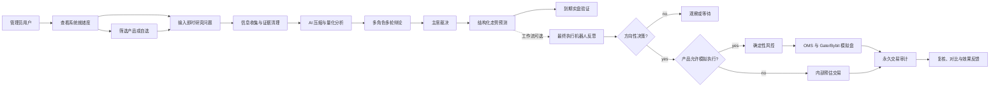

# S3 用户功能等价迁移

> 状态：已实现。此前记录的 CSRF 403、8 页面缺口和 `/api/v2` 能力缺失均已修复；当前 React 保留 13 个业务工作区，生产 smoke 覆盖登录、CSRF、Operations SSE、桌面和移动端布局。本文件后续内容保留迁移契约与验收矩阵。

## 目标

- 在不恢复旧 Python Web/Worker 运行时、不兼容 `/api/v1` 的前提下，把旧版用户可见能力逐项迁移到 Java 26、PostgreSQL 和 React `/api/v2` 主系统。
- 恢复清晰的用户操作动线、完整状态、失败原因、筛选分页、审计详情和人类可读 AI 结果。
- 将新能力纳入同一基线：多工作流、节点级模型兜底、结构化走势预测与到期验证、永久交易仓库、交易所启停、产品执行门禁和仅研究产品的预估交易。
- 建立可机械核对的功能矩阵；每项旧能力只能处于 `MIGRATED`、`REPLACED` 或经用户明确确认的 `RETIRED`，禁止静默遗漏。

## 真相来源

优先级从高到低：

1. 本需求和用户在当前专案中确认的行为。
2. `docs/requirements/29-java-python-breaking-architecture.md` 的 Java/Python 服务边界。
3. 归档需求 19、20、21、22、23、24、25、26、28 的业务契约。
4. 归档 React 组件和 `/api/v1` 只作为交互与字段 oracle，不成为运行时依赖。
5. 当前 `/api/v2`、PostgreSQL schema 和生产事实用于确认已迁移状态，不能用“当前没有”推翻旧需求。

## 信息架构

桌面端使用分组侧边导航，移动端使用页面选择器；刷新后通过 URL 保留当前工作区和子视图。页面标题、首屏指标和操作必须面向研究与交易用户，不展示内部模块名作为主文案。

| 分组 | 工作区 | 必须提供的主能力 |
| --- | --- | --- |
| 工作台 | 研究决策工作台 | 系统就绪度、最新结论、待处理异常、账户摘要、快速入口 |
| 研究决策 | 产品与自选 | 产品分页/组合筛选、详情、全部场所合约、Watchlist CRUD、研究模式、从产品发起研究 |
| 研究决策 | 发起研究 | 即时输入、工作流选择、实时阶段/重试/辩论、完成结果、历史会话 |
| 研究决策 | 自动研究 | 定时状态、下次运行、启停/间隔、手动触发、当前进度、最终结论 |
| 研究决策 | 复核与效果 | 决策列表、详情、证据、风险、人工反馈、运行对比、重放、失败续跑、效果评估 |
| 研究分析与验证 | 走势预测 | 交易所/规范产品/instrument/周期/预测期限选择、实盘公共行情任务、结构化 Forecast 和到期验证 |
| 研究分析与验证 | 量化验证 | 预测指标、回测/统计结果、杠杆/仓位预览、执行风控门禁和不可用原因 |
| 研究分析与验证 | 模拟验证 | 账户概览、区间盈亏、持仓、AI/风控/OMS/交易所统一时间线、模拟订单审计、预估交易 |
| 任务与记录 | 采集与处理 | 信息源状态、手动采集、清理/压缩/补证据任务、原始与规范化证据 |
| 任务与记录 | 运行报告 | 自动研究、采集、市场、风险、AI 成本和治理报告；结构化摘要优先、原始 JSON 可展开 |
| 系统 | 系统设置 | 快速启用、运行基础、代理路由、研究/交易参数、模型服务、模型分工、提示词、角色、费率、风险 |
| 系统 | AI 工作流 | 草稿/发布/回滚/激活、自由节点/连线、轮次、上下文流向、节点模型/Key/思考等级/重试/超时、估算与节点测试 |
| 系统 | 网络诊断 | Firecrawl/交易所/AI 上游代理路由、节点健康、直连门禁、脱敏错误和后台诊断 |

旧版的“模型服务、模型分工、提示词模板、辩论工作流、角色与轮次、A/B 实验、宏观数据密钥”等配置子区不得因页面重组消失；允许合并展示，但字段、读写和状态必须等价。

## 用户主流程

## 功能迁移矩阵

| 能力 | 旧版基线 | 2026-07-15 Java 版 | 目标契约 |
| --- | --- | --- | --- |
| 登录、PoW、数学验证码 | 已有 | 已有，但 SPA 写请求 CSRF 403 | 原始 cookie token header 可写；401/403 文案区分；浏览器回归锁定 |
| 工作台 | 系统、自动研究、建议、待办 | 仅少量计数和最近运行 | 聚合 readiness、异常、最新结论、账户与快捷动作 |
| 自动研究 | 状态、手动触发、过程、结论 | 仅 schedule 配置和后台任务 | `/api/v2/autonomous` 状态与幂等触发；链接到 run/task |
| 即时研究 | 会话列表、SSE 过程、产品上下文 | 基础发起与单次运行 | 会话恢复、工作流选择、阶段详情、失败续跑、产品上下文 |
| 复核与效果 | inbox、详情、反馈、执行、通知 | 只有研究历史/重放/续跑 | 反馈不阻塞测试网自动执行；保留评价、对比、效果和通知状态 |
| 研究历史 | 详情、两次运行对比、重放、分步续跑 | 详情、重放、整轮续跑 | 增加 compare、指定 checkpoint 续跑和可读结果层次 |
| 产品库 | 丰富筛选、Watchlist、详情 | 基础筛选、详情、默认 Watchlist | Gate/Bybit 实盘目录定时同步；补自定义列表更新/删除、精度/最新行情和分页总量；新产品默认仅研究 |
| 走势预测 | 独立公共行情分析任务 | 没有用户入口 | 交易所 -> 规范产品 -> instrument 选择；实盘 K 线；预测期限、方向、区间、置信度和到期自动验证 |
| 量化验证 | 杠杆预览、执行门禁 | 只有生产风险策略配置 | 无副作用 preview API；展示输入、公式、约束和不可用原因 |
| 模拟账户 | 概览/历史标签、筛选、分页、来源完整性、展开详情 | 概览和底部 6 列事实表 | 独立标签；本地决策/风险/OMS与交易所事实统一时间线 |
| 预估交易 | 无 | 开发中 | 仅研究产品方向决策的数量/止盈止损/保证金/净盈亏测算，绝不下单 |
| 采集与处理 | 手动流水线、任务和报告 | 单源采集、证据列表、任务表 | 分阶段任务、状态筛选、证据血缘、重试原因 |
| 运行报告 | 多类结构化报告 | 没有报告工作区 | PostgreSQL projection API；预测方向/区间准确率、主动回避率、摘要、指标和原始审计数据 |
| 快速启用 | profiles、fill-missing、readiness | 默认 seed，无用户入口 | 默认档案预览/应用，敏感配置不覆盖，返回 applied/preserved/skipped |
| AI 配置 | 服务、绑定、提示词、模型刷新、A/B | provider/model 和执行阶段基础编辑 | 补节点/任务绑定、角色模板、提示词、模型探测、实验视图 |
| AI 工作流 | 草稿/发布/回滚、估算、节点测试、运行/恢复、学习 | 草稿/发布/激活和基础画布 | 补 rollback、estimate、test、plan、run history、checkpoint resume、learning |
| 网络诊断 | 路由与后台诊断 | operations 仅展示代理路由 | 无密钥诊断 API、每路由节点健康、fail-closed 状态、脱敏错误 |
| 运营实时性 | operations SSE + fallback | 30 秒轮询；run SSE | 增加全局 operations SSE，断流退避轮询，显示数据新鲜度 |

## 模拟账户与永久交易审计

“账户概览”和“操作历史”使用页内 tabs，默认进入账户概览。时间区间支持 24 小时、7 天、30 天、全部历史和自定义起止时间。

操作历史必须合并以下事实，但不混淆来源：

| 阶段 | 来源 | 关键关联键 | 关键详情 |
| --- | --- | --- | --- |
| AI 决策 | `trade_decision` | workflow/decision | action、confidence、入场/目标/失效、理由 |
| 建议 | `trade_proposal` | decision/proposal | 方向、价格、状态 |
| 最终反思 | `trade_execution_ai_review` | workflow/automation | provider、model、effort、verdict、错误 |
| 风控 | `risk_assessment` | proposal/account | policy、数量、名义价值、杠杆、保证金、最大损失、原因 |
| 预估 | `estimated_trade_projection` | proposal/instrument | 数量、止盈止损、费用、净盈亏、盈亏比；标记非订单 |
| OMS | `oms_order` / event | intent/order | 状态转换、requested/filled、client/exchange order ID |
| 提交 | `exchange_submission_attempt` | order/attempt | 尝试次数、HTTP 状态、脱敏错误、交易所回执 ID |
| 交易所 | account/order/fill/position/PnL facts | account/source event | 真实模拟盘快照、订单、成交、持仓、已实现盈亏 |
| 对账 | reconciliation run | account/run | 状态、差异数、错误与完成时间 |

筛选至少支持账户、来源、阶段、状态、标的、时间和每页数量；使用稳定 cursor 分页。详情只返回白名单字段，禁止凭据、签名、代理 URL 和隐藏思维链。空结果必须区分“确实无记录”“当前筛选无记录”“数据源失败或尚未同步”。

## CSRF 与认证契约

- `CookieCsrfTokenRepository` 使用可读 `XSRF-TOKEN` cookie 和 `X-XSRF-TOKEN` header。
- SPA 写请求发送 cookie 中的原始 token；服务端 header 路径按 plain token 解析，HTML/form 路径保留 XOR 保护。
- login/challenge 仍可匿名；其他 API 必须同时通过管理员 session 与 CSRF（仅安全方法不要求 CSRF）。
- 401 只表示未认证，403 区分 CSRF/权限；前端不得把 403 误导为登录密码错误。
- 每个发布至少真实验证一个无副作用业务冲突 PUT，证明请求越过 CSRF 后进入业务层。

## AI 结果呈现契约

- 默认顺序为：结论、置信度/状态、关键依据、反方观点、风险、建议动作、数据新鲜度、审计原文。
- 单产品走势研究将 Forecast 置于首位，明确实盘参考价、预测期限、方向、预期区间、失效价、到期价和验证结果。
- 多轮辩论按轮次和角色分组，主席结论置顶；不得展示隐藏思维链，模型输出只展示可审计摘要和原始响应白名单。
- `WATCH/HOLD` 明确解释为无需交易；`PROPOSED/GENERATED` 明确解释为建议尚未形成订单；`ESTIMATED` 明确解释为内部测算、不会下单。
- 加载、空、部分失败、重试中、失败、完成和数据陈旧状态必须可区分。

## API 目标

保留已存在的 `/api/v2` 契约，并按领域追加：

- `/api/v2/readiness`：就绪度、默认档案和应用审计。
- `/api/v2/autonomous`、`/api/v2/autonomous/runs`：自动研究状态和幂等触发。
- `/api/v2/research/history/compare`、checkpoint resume、feedback/evaluation。
- `/api/v2/analysis/market-runs`、`/api/v2/analysis/forecasts`：实盘走势预测、到期验证与历史效果。
- `/api/v2/products/catalog-sync/*`：Gate/Bybit 实盘产品目录同步状态与幂等触发。
- `/api/v2/quant/previews`：无副作用量化与交易验证预览。
- `/api/v2/trading/activity`：扩展本地/交易所统一审计、汇总、来源状态和 cursor。
- `/api/v2/reports`：结构化运行报告。
- `/api/v2/workflow-versions/{id}/estimate|test|rollback`、工作流 runs/learning。
- `/api/v2/network/diagnostics`：代理路由与异步诊断。
- `/api/v2/operations/events`：可恢复全局 SSE。

所有写命令使用显式版本或 `Idempotency-Key`；外部 HTTP 不得位于数据库事务内；错误采用 `application/problem+json` 并返回稳定业务 code。

## 验收标准

- 功能矩阵不存在未分类项；`MIGRATED` 项具备 API、UI、成功/失败/空态测试和生产证据。
- CSRF 登录后写链路、刷新后写链路和多标签页写链路均通过。
- 13 个工作区和配置子区在桌面可发现，移动端不横向溢出，刷新保留位置。
- 模拟账户可完整查看本地与交易所历史，筛选、cursor 分页、展开详情和来源状态可用。
- 预估交易和 OMS 订单在数据模型、文案和 UI 上不能混淆。
- 研究不依赖模拟账户启用状态；行情来自实盘公开接口，模拟交易只在工作流显式启用时执行。
- 市场分析必须引用具体 instrument 和预测期限；到期后可看到自动实盘验证与聚合准确率。
- Java、Python、React、Liquibase、OpenAPI、Kustomize、secret scan、HTTP、SSE 和 Playwright 全部通过。
- 单副本 K8S 发布后 Argo CD `Synced/Healthy`，Pod 无重启，生产写 smoke 和核心读链路通过。

## 非目标

- 不恢复旧 Python Web/Worker 或 `/api/v1` 兼容层。
- 不开放真实盘私有写、资金划转、提现或自动签署 TradFi/CFD 协议。
- 不伪造交易所成交、账户历史、量化指标或 AI 证据。
- 不把旧 UI 大文件直接复制进新仓库；交互能力可以复用，代码必须适配当前模块和强类型契约。
