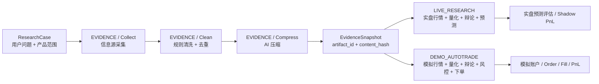

# S3：压缩后分裂的双环境研究工作流

## 目标

一次研究只采集、清洗和压缩一次信息证据。压缩完成后，以不可变 `EvidenceSnapshot` 为共同输入，分别运行实盘研究工作流和模拟盘自动交易工作流。所有交易所的实盘与模拟盘必须在行情、研究、账户和交易数据上硬隔离。

## 范围

- 引入 `ResearchCase`，把一次用户请求下的共享证据段、实盘研究段和模拟执行段组织为一个可查询专案。
- 引入一等 `ResearchSegment`：`EVIDENCE`、`LIVE_RESEARCH`、`DEMO_AUTOTRADE`。
- `EVIDENCE` 段执行采集、传统清洗/去重和 AI 压缩，产出带 `artifact_id + content_hash` 的不可变证据快照。
- 两个分支只引用同一证据快照，不复制或改写压缩内容；压缩事务完成后并行启动，且可分别选择工作流版本、模型、节点、辩论轮次和重试策略。
- `LIVE_RESEARCH` 只使用生产公开行情，产出预测、到期实盘验证和 shadow PnL，永久禁止提交真实订单。
- `DEMO_AUTOTRADE` 使用交易所模拟环境行情与模拟账户，独立完成量化、辩论、执行反思、风险门禁、自动下单和对账。
- 交易所环境统一建模为 `LIVE`、`TESTNET`、`DEMO`。Gate 模拟分支映射 `TESTNET`，Bybit 模拟分支映射 `DEMO`。
- `CanonicalProduct` 和 `VenueInstrument` 保持共享、简单；环境放在研究 scope、行情事实、artifact、账户和交易记录上。

## 非目标

- 不接入真实账户下单，不允许 `LIVE` 环境进入 OMS 提交链路。
- 不把 Gate/Bybit 的环境差异扩散为不同产品类型。
- 不用模拟盘盈亏替代实盘预测准确率，也不把两个分支的 PnL 合并成一个指标。
- 本阶段不承诺 TradFi/CFD 模拟下单；不支持时只做实盘研究与预估交易。

## 分段契约

每段必须持久化 `PENDING/RUNNING/COMPLETED/FAILED/SKIPPED` 状态、开始/结束时间、错误码和安全错误信息。段间只传递显式 artifact 引用；重试从失败段或节点检查点恢复，不重新执行已完成且内容哈希一致的共享段。

## 环境隔离契约

- `market_candle_fact` 唯一键包含 `environment`，同产品同周期同时间的实盘与模拟 K 线不得互相覆盖。
- `research_market_scope`、`market_data_artifact`、`research_forecast` 必须记录环境。
- 账户、订单、成交、持仓、账本继续以 `account_id` 为根，并通过账户的 `exchange + environment` 约束隔离。
- `LIVE_RESEARCH` 不允许绑定模拟账户；`DEMO_AUTOTRADE` 不允许绑定 `LIVE` 行情 artifact。
- 即使 Bybit 官方说明 Demo 公共行情与 Mainnet 相同，也必须使用独立环境标签和端点路由；相同数值不代表相同数据域。
- Gate TestNet 或 Bybit Demo 不可用时，仅对应模拟段失败；实盘研究段不被回滚。

## 交易所能力矩阵

`ExchangeCapabilityQuery` 是交易所/产品环境能力的唯一应用层契约。产品仍由 `CanonicalProduct + VenueInstrument` 表达，能力不塞进产品继承层级。

| 交易所产品 | 行情环境 | 自动下单环境 |
| --- | --- | --- |
| Gate Spot | `LIVE` | 无 |
| Gate Linear Perpetual | `LIVE`, `TESTNET` | `TESTNET` |
| Gate Future | `LIVE`, `TESTNET` | 暂无 |
| Bybit Spot | `LIVE`, `DEMO` | 无 |
| Bybit Linear Perpetual | `LIVE`, `DEMO` | `DEMO` |
| Bybit Inverse/Future | `LIVE`, `DEMO` | 暂无 |

能力不支持时返回明确失败，禁止自动改用其他环境。`GET /api/v2/exchanges/capabilities` 向前端和后续 adapter 暴露同一矩阵。

## 影响文件

- `services/backend/finbot-domain`：研究分段和环境类型。
- `services/backend/finbot-application`：研究专案编排、证据快照绑定、分支策略。
- `services/backend/finbot-infrastructure`：Liquibase 030、JDBC store、环境化行情 gateway/repository。
- `services/backend/finbot-bootstrap`：启动/查询 API 与后台任务 payload。
- `apps/web`：专案时间线、分段状态、两个分支结果与独立 PnL。
- `services/quant`：六种可选策略和指标快照；`QUANT_RESULT` 同时携带策略/指标目录，使后续 AI 节点明确知道可引用的量化能力。

## 验收标准

1. 一次研究专案只有一个完成的压缩快照，两个分支查询到相同 `artifact_id` 和 `content_hash`。
2. 实盘与模拟分支拥有不同 `workflow_run_id`，可配置不同工作流版本并独立失败、重试、完成。
3. 实盘分支不存在 OMS order；模拟分支只能向 Gate TestNet 或 Bybit Demo 提交订单。
4. 数据库无法插入跨环境的 scope/artifact/交易绑定，实盘和模拟 K 线不会冲突覆盖。
5. API/UI 能显示每段、每个工作流节点和辩论轮次的实时状态。
6. 实盘预测以独立 shadow 名义本金计算到期方向 PnL；模拟账户按真实 Demo/TestNet 成交计算 PnL，两者不合并收益率。

## 测试方式

- Domain/Application unit tests：分段状态机、快照复用、分支失败隔离、禁止实盘执行。
- PostgreSQL integration tests：Liquibase、环境唯一键、FK/check 约束、artifact binding。
- Gateway tests：Gate `LIVE/TESTNET` 与 Bybit `LIVE/DEMO` 端点选择。
- API tests：创建专案、查询分段、幂等重试、错误语义。
- 线上 smoke：真实公开行情、真实 TestNet/Demo API、完整双分支运行、Pod/日志/数据库证据。

## 官方依据

- Bybit Demo Trading 使用独立 UID、API key 和 `api-demo.bybit.com`；官方同时说明公共行情与 Mainnet 相同，但 Demo 是隔离模块：<https://bybit-exchange.github.io/docs/v5/demo>
- Gate Futures TestNet 使用独立测试环境；若端点不可用，模拟段按外部依赖失败处理，不回退到生产交易端点。
