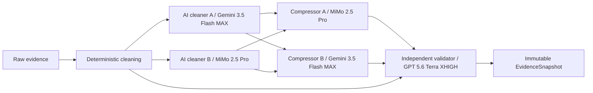

# S3: 多 AI 证据清洗与压缩共识

> 状态：已实现。031 migration、`AI_CLEANER`、多压缩候选、`COMPRESSION_VALIDATOR`、引用门禁和审计持久化已进入生产代码。

## 目标

将默认主工作流的证据准备阶段升级为异构多 AI 协作：确定性清洗后，由多个模型独立审查噪声和事实边界；多个模型独立压缩；最后由不同模型对照原始文档验证遗漏和事实漂移。只有通过验证的结果才能写入不可变 `EvidenceSnapshot`。

## 范围

- 接入 Gemini Chat Completions Provider，启用实测可用的 `gemini-3.5-flash`。
- 新增 `AI_CLEANER` 和 `COMPRESSION_VALIDATOR` 工作流节点类型。
- 默认工作流 v6 使用两个异构 AI 清洗节点、两个异构压缩节点和一个独立验证节点。
- 每次清洗、压缩和验证调用独立写入审计记录，并继续写入统一 `ai_invocation` 台账。
- 默认模型使用各自已验证的最高推理强度：普通 GPT/Grok 为 `XHIGH`，`gpt-5.6-sol` 和 Gemini 为 `MAX`；其他模型按供应商实际支持上限配置。
- 清洗、压缩和验证节点支持独立主模型、备用模型、超时和重试策略。
- 主辩论保持三轮，并尽量让证据、看多、看空、市场结构和风险角色使用不同模型家族。
- 所有 AI 分析角色采用“逻辑角色 + 多席位”：`roleTemplateId` 共享目标与 Prompt，每个物理节点是独立席位并绑定单一 Provider/模型。
- 默认分析席位混排为：证据 `MiMo + Grok`、看多 `Grok + Gemini`、看空 `MiMo + Terra`、市场结构 `Terra + Gemini`、风险 `Gemini + Grok`。
- 工作流编辑器支持从现有 LLM 节点复制异构席位，并自动复制输入输出连线。
- AI Provider 必须通过统一 Profile/Adapter 接入，不允许研究、压缩、辩论或执行服务按厂商名称分支。

## 非目标

- AI 清洗不得修改或删除 `raw_evidence`、`normalized_document`。
- AI 摘要不得升级为事实源；原始证据和确定性规范化文档始终是权威来源。
- 不展示或持久化模型隐藏思维链，只保存结构化结论、引用、错误和调用元数据。
- 图像生成模型不进入文本研究工作流。

## 默认流程

## 一致性规则

1. 每个文档至少需要一个有效清洗审查和两个有效压缩候选，验证器才可以给出已验证结论。
2. 验证器必须同时看到有界原文、全部成功清洗审查和全部成功压缩候选。
3. 最终输出必须保留 `document_id`、`evidence_id`、`source_id`，不得生成输入中不存在的引用。
4. 验证失败时保留确定性原文摘录并把文档标记为失败，禁止静默选择任一候选作为共识。
5. 单个候选失败时按节点重试和备用模型继续；不足最小候选数时 fail closed。

## 影响文件

- `finbot-domain`: 工作流节点类型。
- `finbot-application`: 工作流计划校验、多阶段证据共识执行、审计记录。
- `finbot-infrastructure`: Liquibase 031、JDBC 持久化、Provider 和 v6 默认工作流。
- `finbot-bootstrap`: Gemini Secret 环境变量和现有配置 API 暴露。
- `apps/web`: 工作流节点类型与证据审计状态显示。
- `platform/k8s`: Gemini Secret 引用。

## 验收标准

1. `/models` 实测包含 `gemini-3.5-flash`，Chat Completions `reasoning_effort=max` 请求成功。
2. v6 为唯一发布的默认工作流，v5 归档且历史运行仍可查询。
3. 一个文档会产生两个清洗审查、两个压缩候选和一个验证审计记录。
4. 验证器输出是唯一进入 `ai_compression` 和 `COMPRESSION_PACKAGE` 的最终内容。
5. 清洗或压缩候选缺失、验证输出无效、供应商失败和重试耗尽均有测试。
6. Java 全量测试、Web 测试与构建、Liquibase PostgreSQL 集成测试、Kustomize render 和线上 Provider probe 通过。
7. 五个分析逻辑角色各有两个异构席位；任一席位的失败、Fallback 和调用成本可独立查询。
8. 模型请求超过 `maximumReasoningEffort` 时显式失败，不得静默降级。
